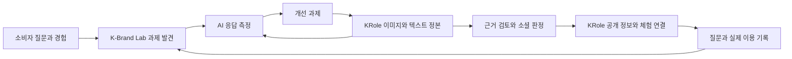

# K-Brand Lab PRD v3.0

소비자 질문 기반 브랜드 연구와 AI 응답 측정 및 KRole 정본·판정 연계

| 문서 항목 | 내용 |
|---|---|
| 작성일 | 2026-09-09 |
| 문서 목적 | 제품·디자인·개발·연구·운영 담당자가 동일한 범위와 검수 기준으로 MVP를 구현하도록 정의 |
| 제품 상태 | 신규 개발 및 기존 자산 재사용을 위한 요구사항 기준안 |
| 우선 출시 형태 | 운영자가 수행하는 유료 연구 프로젝트와 이를 지원하는 웹 서비스 |
| 핵심 범위 | 질문 수집 → 과제 발견 → AI 측정 → 정본 및 판정 → 공개 및 실행 → 재측정 |
| 사업 연결 | KRole의 상품·브랜드·POI 정보와 교육·이벤트·상품 거래 연결 |
| 수치의 성격 | 표본·가격·성능·운영 목표는 별도 표기가 없는 한 설계 가정이며 실적이 아님 |

## 문서 탐색

- [1 제품 정의와 사업 목적](#sec-1)
- [2 사용자와 해결할 문제](#sec-2)
- [3 제품 원칙과 범위](#sec-3)
- [4 서비스 구조와 사용자 흐름](#sec-4)
- [5 화면 및 기능 요구사항](#sec-5)
- [6 데이터 구조와 정본 관리](#sec-6)
- [7 소셜 판정과 연구 참여](#sec-7)
- [8 AI 측정 방법과 지표](#sec-8)
- [9 변경 전후 검증 설계](#sec-9)
- [10 KRole 연계 계약과 동기화](#sec-10)
- [11 권한과 데이터 보호](#sec-11)
- [12 품질과 운영 요구사항](#sec-12)
- [13 분석과 성과 지표](#sec-13)
- [14 납품물과 수익 모델](#sec-14)
- [15 MVP 실행과 투자 판단](#sec-15)
- [16 검수 시나리오](#sec-16)
- [17 기존 자산 점검과 미결 사항](#sec-17)
- [18 출처와 원안 수정 이력](#sec-18)

<a id="sec-1"></a>
## 1 제품 정의와 사업 목적

### 1.1 제품 정의

K-Brand Lab은 소비자가 한국 상품·브랜드·문화 및 관광 장소에 대해 실제로 묻는 질문과 경험을 분석해, 정보 공백·검증 공백·구매 장벽·제품 및 서비스 문제·새로운 수요를 발견하는 연구 서비스다. AI 응답 측정은 발견한 문제가 AI 검색 환경에서 어떻게 드러나는지 관찰하고 개선 전후를 비교하는 기능이다.

연구 결과는 KRole의 이미지·텍스트 정본, 검토 과제, 공개 설명, 관련 상품·교육·이벤트에 연결한다. 연구 보고서와 서비스 운영 데이터가 같은 근거와 버전을 참조하도록 하여 반복 조사·편집·배포 비용을 줄인다.

### 1.2 고객이 얻어야 하는 답

1. 소비자는 어떤 상황에서 무엇을 해결하려고 하는가.
2. 구매·방문·사용을 망설이게 하는 정보와 경험은 무엇인가.
3. 설명·운영·제품 중 무엇을 바꿔야 하는가.
4. AI는 해당 질문에 어떤 답과 출처를 제시하며, 확인된 사실과 얼마나 일치하는가.
5. 어떤 정본을 보완하거나 어떤 주장을 검토해야 하는가.
6. 개선 이후 정보 품질, 운영 비용, 소비자 행동과 유료 이용이 어떻게 달라졌는가.

### 1.3 KRole과의 사업적 연결

| 단계 | 고객에게 제공하는 가치 | KRole에 남는 자산 |
|---|---|---|
| 질문 진단 | 브랜드가 먼저 해결할 문제의 우선순위 | 맥락과 출처가 있는 질문 지도 |
| 정본 구축 | 사실·이미지·언어별 설명을 일관되게 관리 | 권리·출처·버전이 연결된 정본 |
| 판정 운영 | 경험과 주장에 대한 근거·한계 확인 | 검토 이력과 판정자 운영 방법 |
| 정기 관리 | 새로운 질문과 정보 변경에 대응 | 갱신 기록과 시계열 측정 자료 |
| 소비자 서비스 | 근거 확인에서 이용·구매까지 연결 | 공개 정보, 피드백, 허용된 거래 기록 |

사업의 차별성은 질문, 정본, 독립적인 검토, 변경 이력, 소비자 이용을 연결해 누적하는 데 있다. AI 언급량만 제공하는 도구의 성능이나 대학 명칭 자체를 경쟁 우위로 가정하지 않는다.

<a id="sec-2"></a>
## 2 사용자와 해결할 문제

| 사용자 | 주요 업무 | 현재의 어려움 | 제품에서 완료할 일 |
|---|---|---|---|
| 한국 브랜드·상품 담당자 | 해외 판매, 고객 지원, 브랜드 정보 관리 | 질문·FAQ·제품 설명이 채널별로 분산 | 우선 과제 승인, 자료 제출, 개선 및 유료 갱신 판단 |
| POI·교육·이벤트 운영자 | 방문 조건과 예약·서비스 안내 | 언어·시점·판매 채널별 조건 불일치 | 최신 조건 확정, 현장 검토 대응, 예약 경로 연결 |
| K-Brand Lab 연구 운영자 | 질문 연구, 측정, 고객 보고 | 원자료와 해석·수치의 연결이 약함 | 질문부터 개선 결과까지 추적 가능한 프로젝트 납품 |
| 정본 편집자 | 이미지·텍스트 작성과 배포 | 같은 사실을 반복 편집하며 오류 발생 | 기준 데이터를 갱신하고 영향을 받는 게시물 확인 |
| 검토자·학생 기여자 | 출처 확인, 현장 관찰, 경험 기록 | 검토 범위·보상·책임이 불명확 | 배정받은 주장에 근거와 판단을 독립적으로 제출 |
| 대학 연구자 | 방법론·판정 품질·소비자 판단 연구 | 실제 현장 자료와 지속적 연구 환경 부족 | 허용된 자료로 연구 설계·분석·교육 수행 |
| 해외 및 국내 소비자 | 상품·장소·체험 선택 | 설명과 실제 조건을 확인하기 어려움 | 근거·미확인 사항을 보고 질문·예약·구매 진행 |

### 2.1 초기 고객 선정

첫 고객은 특정 국가나 업종으로 고정하지 않는다. 다음 조건을 충족하는 한 브랜드의 제품군과, 연결 가치가 있는 POI 또는 체험을 우선 검토한다.

- 반복 고객 질문과 갱신해야 하는 실제 정보가 있다.
- 자료와 이미지의 사용 권한을 확보할 수 있다.
- 담당자가 사실 확인과 개선에 참여할 수 있다.
- 고객 문의 또는 예약·구매 등 결과를 허용된 범위에서 관찰할 수 있다.
- 진단 이후 정기 관리에 대한 유료 수요를 검증할 수 있다.

초기 인터페이스와 측정 언어는 한국어·영어를 기본안으로 한다. 실제 목표 시장에 맞는 언어와 모집 대상은 프로젝트 착수 시 확정한다. 영어 질문 결과를 모든 해외 시장의 반응으로 일반화하지 않는다.

<a id="sec-3"></a>
## 3 제품 원칙과 범위

### 3.1 반드시 지킬 제품 원칙

| ID | 원칙 | 시스템에 적용할 규칙 |
|---|---|---|
| INV-01 | 질문의 출처 보존 | 실제 소비자 질문·연구자 도출·AI 제안을 구분하고 합산 방식 표시 |
| INV-02 | 관찰과 해석 구분 | 원문, 분류, 해석, 과제 제안을 별도 저장 |
| INV-03 | 측정과 진실 구분 | AI 출력의 존재가 그 내용의 사실성을 보증하지 않음 |
| INV-04 | 정본은 근거를 관리 | 공식 자료도 주장 유형과 유효 시점에 맞게 검토 |
| INV-05 | 가시성과 판정 품질 분리 | AI 언급·인용·추천으로 판정 등급을 올리지 않음 |
| INV-06 | 편집·검토·판매 역할 분리 | 작성자가 자기 주장에 대한 독립 검토자가 될 수 없음 |
| INV-07 | 측정 조건과 버전 기록 | 질문·모델·도구·언어·시장·시간·판정 기준을 고정·기록 |
| INV-08 | 분모와 누락 공개 | 오류·거절·미수집·분류 불가를 숨기거나 0으로 바꾸지 않음 |
| INV-09 | 회차와 재시도 보존 | 재시도를 독립 표본으로 합산하지 않고 최초 시도부터 보존 |
| INV-10 | 권리와 공개 범위 명시 | 고객 비공개 자료를 동의 없이 공개 정본으로 전환하지 않음 |
| INV-11 | 개선 원인 단정 금지 | 단순 전후 변화에 인과 효과 또는 매출 효과라는 명칭을 붙이지 않음 |
| INV-12 | 재현 가능한 계산 | 같은 저장 자료와 계산 버전으로 같은 지표를 산출; 재호출의 동일 답변은 보장하지 않음 |

### 3.2 범위와 우선순위

P0는 첫 유료 실증과 공개 연계에 필요한 기능, P1은 반복 운영 확인 후 확장 기능, P2는 별도 수요·방법 검증 이후 기능이다.

| 영역 | P0 | P1 및 P2 |
|---|---|---|
| 질문 수집 | 수동 입력·CSV, 원문/맥락/출처, 중복 묶기 | P1 허용된 CRM·리뷰 연결, P2 대규모 다국어 수집 |
| 과제 도출 | 여정 분류, 5종 과제, 운영자 승인 | P1 추천 분류 개선, P2 업종 간 비교 |
| 정본 | 브랜드·제품·POI, 이미지·텍스트·주장·증거·버전 | P1 채널별 배포, P2 외부 데이터 라이선스 |
| 판정 | 제한된 주장 유형, 독립 검토, 이의제기와 재검토 | P1 대학·전문가 참여 확대, P2 검증된 방법의 규모 확대 |
| AI 측정 | 공급자 어댑터 2종, 언어 2종, 원자료 및 핵심 지표 | P1 추가 모델·언어, P2 대규모 자동 실험 |
| 공개 서비스 | KRole 페이지, 근거 요약, 관련 예약·판매 링크 | P1 외부 판매 연동, P2 별도 거래 시스템 확장 |
| 성과 | 클릭·질문·수동 확인 거래, 총원가 기록 | P1 웹마스터·거래 시스템 연결, P2 인과 추론 실험 |
| 보고 | 화면·Markdown·CSV·권한 있는 JSON 내보내기 | P1 반복 보고 자동화, P2 비교 데이터 상품 |

### 3.3 MVP에서 제공하지 않는 것

- AI 검색 순위·추천·인용·매출 증가 보장 또는 E-E-A-T 인증.
- 모든 소비자 질문, 검색 유입 또는 AI 학습 출처의 전수 파악.
- 대학 이름이나 단순 다수결에 기반한 정품·안전·법적 적합성 인증.
- 고객 승인 없는 게시, 리뷰 작성, 제3자 위키·커뮤니티의 자동 편집.
- 공개 AI 서비스의 접근 제한을 우회하는 자동 수집.
- 독자 결제·환불·재고 시스템의 신규 구축. P0는 기존 판매·예약 경로와 연결한다.
- 단일 종합 권위 점수 또는 모든 브랜드를 한 줄로 정렬하는 공개 순위표.
- 정치인 사례를 실제 고객 성과로 사용하거나 미검증 과거 실측량을 홍보하는 기능.

<a id="sec-4"></a>
## 4 서비스 구조와 사용자 흐름

### 4.1 논리 구조



그림의 정본→측정 연결은 기준 자료 대조와 재측정 요청을 뜻한다. 외부 AI 가시성 측정 프롬프트에 정본 내용·정답·목표 URL을 넣는 동작은 아니다. 정본을 직접 제공하는 별도 검색·답변 기능 시험은 `assisted` 실험으로 구분한다.

### 4.2 제품 간 역할

| 구성 | 소유할 책임 | 통합 원칙 |
|---|---|---|
| Theme Lab | 질문 맥락·테마 분석의 공통 기능 후보 | 기존 구현을 점검한 후 재사용; 존재·완성도는 사전 확정하지 않음 |
| PlaceLab | POI 및 측정 어댑터 재사용 후보 | 공급자별 동작과 계산을 재검증한 코드만 사용 |
| K-Brand Lab | 고객 프로젝트, 질문 연구, 측정, 개선 및 보고 | 브랜드 담당자와 연구 운영자의 작업 화면 |
| KRole | 정본, 판정, 공개 정보, 소비자 연결 | 동일 기준 데이터를 사용하는 소비자 화면과 운영 기능 |
| My Vibe Lab 등 | 경험·질문 유입 후보 | P0는 표준 가져오기; 연결 도구 개발은 수요에 따라 진행 |

초기 구현은 공통 인증·권한·저장소를 사용하는 모듈형 서비스로 제안한다. 물리적 서버 분리나 마이크로서비스 도입은 요구사항이 아니다. 기존 KRole 시스템이 독립적으로 존재하면 10절의 계약으로 연계한다.

### 4.3 주요 사용자 흐름

**브랜드 프로젝트**

1. 운영자가 고객·목표 시장·사업 질문·자료 권한·비용 한도를 등록한다.
2. 고객 문의와 경험을 가져오고 개인정보 및 출처를 점검한다.
3. 운영자가 질문을 여정과 과제로 묶고 고객과 우선순위를 확정한다.
4. 기준 사실과 진단 질문 세트를 만들고 측정 조건을 고정한다.
5. 기초 측정을 수행하여 오류·정보 부족·설명 차이·구매 장벽을 구분한다.
6. 과제에 따라 정본 갱신, 자료 요청, 판정, 운영 변경 또는 제품 개선을 실행한다.
7. 공개 가능한 결과만 KRole에 게시하고 관련 이용 경로를 연결한다.
8. 같은 조건으로 재측정하고 소비자 반응·운영 비용·유료 갱신을 함께 검토한다.

**검토자**

배정 확인 → 이해관계와 경험 범위 신고 → 주장별 근거 검토 → 독립 제출 → 필요한 조정 또는 추가 확인 → 판정 기록 확정. 다른 검토자의 응답과 브랜드가 바라는 결론은 최초 제출 전에 보여주지 않는다.

**소비자**

질문 또는 검색으로 정보 접근 → 핵심 답과 이미지 확인 → 근거·조건·미확인 사항 확인 → 추가 질문 또는 관련 상품·교육·이벤트 이용 → 실제 경험 피드백. 내부 모델 설정과 연구 코드명은 기본 소비자 화면에 노출하지 않는다.

<a id="sec-5"></a>
## 5 화면 및 기능 요구사항

### 5.1 화면 목록

| 화면 | 기본 표시 | 주요 작업 |
|---|---|---|
| 프로젝트 홈 | 해결할 질문, 진행 중 과제, 자료 부족, 변경 요청 | 다음 작업 선택; AI 점수를 첫 화면의 유일한 중심으로 삼지 않음 |
| 질문 지도 | 여정·맥락·출처 종류·관찰 건수 | 원문 열람, 중복 묶기, 해석 승인 |
| 과제 상세 | 문제, 근거, 담당자, 고객 영향, 실행 유형 | 자료 요청, 정본·판정 연결, 실행 승인 |
| 정본 편집 | 이미지·언어별 설명·주장·유효 조건 | 버전 비교, 검토 요청, 영향받는 게시물 확인 |
| 검토 작업함 | 배정 주장, 필요한 전문성, 제출 기한 | 독립 응답, 보류, 이해관계 신고 |
| 측정 설정 | 질문 수, 환경, 반복, 예상 실행 수·비용 | 조건 고정, 실행, 일시 중지 |
| 측정 결과 | 수집 상태, 언급·추천·인용·정확성 | 원문 추적, 누락 확인, 사람 검수, 비교 |
| KRole 공개 페이지 | 질문에 대한 답, 이미지, 근거와 조건, 관련 이용 | 근거 열기, 이의제기, 예약·판매처 이동 |
| 보고 및 성과 | 과제 변화, 조치, 측정, 관찰 행동, 총원가 | 고객 검토, 내보내기, 다음 주기 결정 |

### 5.2 기능별 요구사항과 완료 조건

| ID | 우선 | 요구사항 | 완료 조건 |
|---|---|---|---|
| FR-01 | P0 | 프로젝트 및 고객 권한 관리 | 다른 고객의 질문·비공개 자료를 검색·URL·내보내기로 열 수 없음 |
| FR-02 | P0 | 질문·경험 수동 및 CSV 등록 | 원문, 출처 종류, 수집일, 언어, 권한 상태와 원본 행 번호가 보존됨 |
| FR-03 | P0 | 질문 정규화와 중복 묶기 | 병합해도 원문이 사라지지 않고 고유 질문 수와 관찰 건수를 각각 표시 |
| FR-04 | P0 | 여정 및 5종 과제 분류 | 자동 제안과 사람 확정이 구분되고 재분류 이력이 남음 |
| FR-05 | P0 | 과제 우선순위와 실행 유형 | 빈도만으로 결정하지 않고 영향·근거·긴급성·비용을 기록; 보류 가능 |
| FR-06 | P0 | 이미지·텍스트 정본 편집 | 권리, 출처, 확인일, 언어, 버전 및 연결 주장 없이 공개할 수 없음 |
| FR-07 | P0 | 주장별 증거 대조 | 공식 주장·문서 확인·경험 진술·추정이 화면과 저장소에서 구분됨 |
| FR-08 | P0 | 독립 검토와 판정 기록 | 자기 검토 차단, 다른 응답 선공개 차단, 미확인·이의제기 지원 |
| FR-09 | P0 | 진단 질문 세트 버전 관리 | 원 질문 및 번역 연결, branded/open 구분, 확정 후 직접 수정 차단 |
| FR-10 | P0 | 측정 실행 및 비용 통제 | 계획 실행 수가 미리 보이며 슬롯·재시도·비용이 별도 기록됨 |
| FR-11 | P0 | 공급자 2종 결과 정규화 | 미지원 인용 필드는 N/A로 유지하고 실제 요청·응답·버전을 보존 |
| FR-12 | P0 | 측정 결과 분석 | 모든 수치에서 분모·필터·원 응답으로 이동 가능 |
| FR-13 | P0 | 사람 검수와 재계산 | 원 응답을 덮어쓰지 않고 분석 버전을 추가; 이전 보고서는 재현 가능 |
| FR-14 | P0 | 정본 변경과 재측정 연결 | 변경된 주장을 사용하는 게시물·질문을 찾아 새 측정 후보로 제시 |
| FR-15 | P0 | KRole 게시 및 철회 | 승인 버전·권한·판정 상태만 게시; 철회 시 공개 및 배포 상태 갱신 |
| FR-16 | P0 | 소비자 질문 및 경험 피드백 | 공개 표시 동의와 내부 분석 동의를 구분; 구매 강제 없이 제출 가능 |
| FR-17 | P0 | 예약·판매 경로 연결 | 가격·판매자·조건·확인일 표시, 링크 이동과 실제 거래를 구분 |
| FR-18 | P0 | 프로젝트 보고·내보내기 | 14절 산출물, 필터·기간·한계·권한 적용; 비공개 데이터 누출 없음 |
| FR-19 | P1 | 웹마스터·거래 데이터 연결 | 지원 범위와 기간을 기록하고 실험 측정과 별도 지표로 제공 |
| FR-20 | P1 | 정기 일정과 갱신 알림 | 갱신 만료·비용 한도·실패 시 중지 및 담당자 알림 |

### 5.3 질문과 과제 분류

여정은 필요·상황 발견, 제품군 탐색, 브랜드·제품 비교, 구매 조건 확인, 사용·문제 해결, 재구매·이탈의 6단계를 사용한다. 각 질문은 주된 여정 1개와 보조 여정 여러 개를 가질 수 있다. 특정 여정에 특정 측정 지표를 하나씩 고정 배정하지 않는다.

과제의 주된 유형은 정보 공백, 검증 공백, 구매 장벽, 제품·서비스 부적합, 새로운 수요 중 하나다. 보조 유형과 판단 근거를 함께 저장한다. 예를 들어 답이 정확해도 만족도가 낮다면 가격·기대·개인 취향·표본·제품 문제를 추가로 확인하며 제품 결함으로 자동 확정하지 않는다.

기본 우선순위는 고객 영향, 반복 관찰, 근거의 강도, 정보의 시급성, 실행 비용을 보여주는 목록으로 정한다. 합성 점수를 사용할 경우 가중치·버전을 공개하고 운영자가 사유를 남겨 조정할 수 있게 한다. 출처가 다른 관찰 건수를 인구 수준의 발생 빈도로 표시하지 않는다.

<a id="sec-6"></a>
## 6 데이터 구조와 정본 관리

### 6.1 공통 데이터 규칙

- 모든 객체는 고유 ID, 생성·수정 시각, 소유 프로젝트 또는 공개 범위, 작성자 및 감사 기록을 가진다.
- 시각은 UTC로 저장하고 화면은 이용자 시간대로 표시한다. 시장, 언어와 시간대는 서로 다른 필드다.
- 공개 객체와 고객 비공개 객체의 권한을 상속에만 의존하지 않고 조회 시 확인한다.
- ID 연결은 단방향 문자열 복사가 아니라 참조 관계로 관리한다. 삭제·철회된 객체는 사용 불가 상태와 사유를 반환한다.
- 기준 데이터의 내용이 바뀌면 새 버전을 생성한다. 과거 측정은 당시 사용한 질문·기준·분석 버전을 유지한다.

### 6.2 주요 객체

| 객체 | 필수 정보 | 연결 및 목적 |
|---|---|---|
| Organization / Project | 고객, 시장, 목표, 담당자, 비용 한도, 계약 범위 | 테넌트 격리와 운영 단위 |
| SourceRecord | 출처 종류, 수집일, 원문 위치, 이용 범위, 개인정보 상태 | 질문·증거의 유래 추적 |
| Question | 원문, 정규화문, 실제/연구자/AI 구분, 언어, 상황, 하려는 일, 망설임, 기존 답 | 원문 보존 및 맥락 분석 |
| QuestionObservation | 질문 ID, SourceRecord, 발생 시점, 중복 그룹 | 고유 질문 수와 관찰 건수 분리 |
| Theme / Issue | 질문 연결, 주·보조 유형, 영향, 근거, 담당자, 상태 | 연구를 실행 과제로 전환 |
| Entity | 브랜드/제품/POI, 공식명, 언어별 별칭, 부모 브랜드, 외부 식별자 | 동명이인·동명 브랜드·제품 구분 |
| ClaimRevision | 주장 문장, 유형, 대상, 시장·기간·조건, 증거, 검토 상태 | 정확성 대조와 판정의 최소 단위 |
| Evidence | 원출처, 발행·확인 시각, 적용 범위, 권리, 사본 허용 여부, 콘텐츠 해시 | 주장 지원·반박·불충분 근거 |
| MediaAsset | 원본, 해시, 촬영·제작자, 이용권, 만료, 언어별 대체 텍스트, 연결 주장 | 이미지와 사실의 관계 및 재사용 |
| CanonicalRevision | Entity, ClaimRevision, 이미지, 언어별 설명, 유효기간, 승인 | KRole 및 고객 채널의 기준 정보 |
| ReviewCase / ReviewResponse | 주장 버전, 방법 버전, 역할·이해관계, 근거, 독립 응답, 조정 | 판정의 책임·범위·재검토 관리 |
| ProbeSet / Probe | 질문 연결, 원문·번역 쌍, 유형, 목표 엔티티, 평가/개발 구분, 버전 | 측정 질문의 변경·편향 통제 |
| MeasurementRun / Slot / Attempt | 고정 조건, 계획 슬롯, 시도별 상태·비용·원 응답 | 표본과 기술 실행 분리 |
| AnswerAssessment | 응답 분류, 엔티티, 주장별 대조, 인용 관계, 분석자·버전 | 원 응답과 해석 분리 |
| Publication | 정본·판정 버전, 공개 URL, 채널, 승인자, 게시·철회 상태 | 원본과 공개 결과의 관계 |
| Intervention | 과제, 변경 전후 버전, 실행일, 공개일, 확인 시각, 비교 대상 | 전후 분석의 기준점 |
| Offering / OutcomeEvent | 상품·교육·이벤트, 판매 주체, 거래 조건, 이벤트 ID·시각·동의 | 소비자 행동과 이행 결과 |
| ReportSnapshot | 포함 자료 ID, 계산·방법 버전, 필터, 한계, 발행 시각 | 보고서 재현과 변경 이력 |

### 6.3 정본과 주장 상태

정본의 편집 상태는 `draft → in_review → approved → published`이며, 수정하면 새 revision의 `draft`로 시작한다. 기존 게시본은 보존하되 상황에 따라 `superseded`, `expired`, `withdrawn`으로 전환한다.

주장의 지식 상태는 `brand_reported`, `supported`, `contradicted`, `insufficient`, `disputed`, `expired`로 관리한다. 편집 승인과 사실 검증 상태는 독립적이다. `approved` 문서 안에도 명확히 표시된 미확인 주장이 있을 수 있다. `supported`는 지정 근거와 범위에서 지지됨을 뜻하며 보편적 인증을 의미하지 않는다.

| 주장 유형 | 필요한 기준 자료 | 자동화 범위 |
|---|---|---|
| 운영·거래 조건 | 책임 있는 운영자의 최신 문서와 적용 시점 | 일치·유효기간 검사 후 담당자 확인 |
| 제품 규격·원산지 | 관련 문서와 추적 가능한 자료 | 문서 대조 보조; 원산지·정품 확정은 증거와 적격 검토 필요 |
| 성능·안전·친환경성 | 주장에 적합한 시험·검증 자료와 적용 범위 | AI 추정 또는 일반 학생 투표로 확정 불가 |
| 체험·사용성 | 실제 경험, 시점, 조건과 참여자 특성 | 진술 분포와 불일치 공개; 객관적 인증으로 전환 불가 |
| 문화적 가치·진정성 | 창작자·전문가·참여자 관점과 근거 | 관점별 기록; 단일 사실 점수로 통합하지 않음 |

### 6.4 이미지와 다국어 정보

이미지는 연결된 상품·장소·조건을 정확히 설명해야 한다. AI 생성 설명 이미지는 생성 사실을 표시하고 실제 현장·시험 증거로 사용하지 않는다. 이미지의 영문 설명이 한국어 정본과 다른 사실을 주장하면 게시를 보류한다. 권리 만료는 연결된 게시물에 영향을 주는 사건으로 처리한다.

SSoT는 하나의 기준 데이터라는 뜻이며 하나의 도메인 강제가 아니다. 고객 공식 채널과 KRole이 동일 데이터를 참조할 수 있다. 검색용 canonical URL은 중복·유사 페이지의 대표 URL 지정으로 별도 관리한다. 번역 페이지를 일괄 한국어 URL로 canonical 처리하지 않는다.[2]

<a id="sec-7"></a>
## 7 소셜 판정과 연구 참여

### 7.1 판정 단위와 방법

판정 단위는 브랜드 전체에 대한 호감도가 아니라 **특정 버전의 주장과 적용 조건**이다. 공개 결과에는 대상 주장, 확인 근거, 검토자 역할, 방법 버전, 제출·확정일, 미확인 사항과 이의제기 경로를 표시한다.

P0는 범위가 명확한 문서 대조와 실제 경험 기록부터 시작한다. 문서 대조의 운영 시작안은 적격 검토자 2인의 독립 검토와 불일치 시 제3자의 근거 조정이다. 이는 통계적 진실 보장이나 업계 인증 기준이 아니다. 전문성이 필요한 주장은 해당 검토 역량과 자료가 확보될 때만 처리한다.

체험·사용성은 관찰 인원, 모집 경로, 실제 경험 확인 방식과 조건별 분포를 표시한다. 최소 인원·합의율을 충족했다는 이유만으로 정품·안전 인증을 부여하지 않는다. 기존 사업 구상의 30명·80% 기준은 별도 검증 전까지 기본 합격 규칙으로 구현하지 않는다.

### 7.2 검토 상태와 운영

`requested → eligibility_check → assigned → independent_review → adjudication 또는 ready → published → challenged 또는 expired → reopened`

- 필수 자료가 없으면 `insufficient`로 보류한다. 처리 기한이 지났다는 이유로 승인하지 않는다.
- 검토자는 자료 작성·판매·협찬·고용·개인 관계 등 관련 이해관계를 신고한다.
- 다른 검토자의 응답은 최초 제출 전 비공개다. 수정 응답은 최초 응답과 함께 이력으로 남긴다.
- 최종 판정의 기준과 이의제기 판단 이유를 기록한다. 판정 결과는 영업 담당자가 직접 바꿀 수 없다.
- 주장 변경 또는 근거 만료 시 적용 가능성을 확인하고 기존 판정을 새 버전에 자동 승계하지 않는다.
- 보상은 수행 시간과 적정 기여에 연동한다. 긍정 평가, 다수 의견 일치, 구매 유도에 연동하지 않는다.
- 판정자 품질은 근거의 적합성·재검토 결과·교육 이수·오류 수정 등으로 관찰한다. 대학 간 서열 점수는 만들지 않는다.

### 7.3 대학 협력

교수·대학원생은 질문 분류의 타당성, 검토자 간 일치도, 오류 유형과 소비자 이해도 연구에 참여할 수 있다. 학부생은 교육받은 자료 조사자·검토 기여자 또는 독립 연구 참여자로 참여할 수 있다. 동일 자료의 작성자·독립 검토자·효과 실험 참여자가 겹치지 않도록 배정 기록을 검사한다.

학술 연구 데이터 수집은 해당 연구의 승인·동의·보상·보관 조건을 충족한 프로젝트에서만 활성화한다. 기관의 연구윤리 절차와 상업적 운영 계약을 구분한다. 학생에게 공개 리뷰 작성, 상품 구매, 성적과 연계된 긍정 평가를 요구하지 않는다.

대학명·교수명·로고·연구 결과의 공개는 합의된 범위에서만 허용한다. 교수 개인의 협력을 대학의 공식 인증으로 표시하지 않는다. 특정 대학과의 협약·참여·연구비 확보는 현재 제품의 확정 사실로 입력하지 않는다.

<a id="sec-8"></a>
## 8 AI 측정 방법과 지표

### 8.1 측정의 세 층

| 층 | 저장할 자료 | 허용되는 해석 |
|---|---|---|
| AI 관찰 | 질문, 실행 조건, 원 응답, 제공된 출처·인용 | 해당 조건에서 어떤 출력이 관찰되었는지 |
| 소비자 판단 | 주관적 평가, 객관적 이해 문항, 판단 시간 등 | 실제로 측정한 지표의 결과; 표본·설계 범위 명시 |
| 이용 및 거래 | 클릭, 문의, 예약, 결제, 취소, 이행 기록 | 관찰된 행동; 증분 효과·인과관계는 비교 설계가 있을 때 별도 분석 |

L1 전체를 진실, L2 전체를 진술, L3 전체를 가설로 고정하지 않는다. AI 응답의 내용은 검증 대상이며, 소비자 이해도는 객관식으로 측정할 수 있고, 거래는 관찰 사실일 수 있다. 관찰 사실과 그 원인에 대한 해석을 구분한다.

### 8.2 측정 환경과 비교 가능성

환경은 `provider_api`, `consumer_interface_observation`, `webmaster_aggregate`로 구분한다. 공급자 API 결과를 소비자용 서비스 전체의 노출률로 표시하지 않는다. 소비자 화면 관찰은 허용된 수동·공식 수단으로 수행하고 세션·계정·개인화·지역 등 확인 가능한 조건과 확인 불가 항목을 기록한다.

P0 자동 실행은 어댑터가 검수된 공급자 2종을 사용한다. 우선 재사용 후보는 원안의 OpenAI 계열 API와 Gemini API이나, 정확한 모델과 도구 설정은 구현 전 점검 후 정한다. ChatGPT라는 서비스 명칭을 API 모델 ID 대신 저장하지 않는다. 가격과 응답 스키마는 공급자·API 버전별로 관리한다.

### 8.3 고정해야 하는 측정 설정

| 분류 | 기록할 값 |
|---|---|
| 질문 | probe_set_version, probe_id, 원문, 번역 쌍 ID, branded/open/H2H/사실 확인 유형 |
| 실행 환경 | provider, model_requested, model_returned, API 버전, surface, 도구 설정 및 검색 실행 여부 |
| 조건 | 언어, 대상 시장, 실제 요청에 적용된 지역 설정, 세션 초기화, temperature 등 지원되는 매개변수 |
| 목적 | external_visibility 또는 assisted_test, 기준/개선 후/비교 대상, 개발 질문/평가 질문 |
| 시점 | 예정·시작·종료 시각, 관찰 주기, 반복 번호 |
| 판정 | method_version, 기준 주장 버전, 분석 모델·프롬프트 버전, 사람 검수 상태 |
| 추적 | run_id, slot_id, attempt_id, request_id, raw_response_hash, 비용 가격표 버전 |

확인할 수 없는 값은 `unknown`으로 저장한다. 해당 공급자가 지원하지 않는 값은 `not_supported`로 저장한다. 요청 모델과 실제 응답 모델이 다르거나 주요 설정이 바뀌면 시계열에 변경점을 표시하고 동일 조건 비교를 제한한다.

외부 가시성 측정은 매 슬롯 새 세션을 기본으로 한다. 모델에 브랜드 정답·정본·검토 결론을 제공하지 않는다. 브랜드명이 없는 탐색 질문은 open, 브랜드가 명시된 질문은 branded, 두 브랜드를 비교하는 질문은 H2H로 분리한다. 서로 다른 질문 유형의 결과를 단일 노출률로 합산하지 않는다.

### 8.4 슬롯과 시도의 구분

- **Run:** 하나의 고정된 측정 계획과 실행 묶음.
- **Slot:** 질문 1개 × 언어 1개 × 환경 1개 × 반복 1회 × 시점 1개의 논리적 관찰 단위.
- **Attempt:** 해당 슬롯에서 실제로 전송한 요청. 재시도는 새 Attempt이며 새 Slot이 아니다.
- 집계에는 슬롯별 최초로 정상 수집된 최종 응답 1개를 사용한다. 나쁜 답이 나왔다는 이유로 재시도하지 않는다.
- 자동 재시도 대상은 일시적 네트워크·속도 제한·서버 오류 등으로 제한한다. 초기 기본안은 최초 시도와 재시도 2회까지이며 공급자별 정책과 예산을 따른다.
- 거절·정보 부족·브랜드 미언급은 기술 실패가 아니다. 재시도하여 좋은 답으로 교체하지 않는다.
- 재시도된 모든 요청의 비용과 원자료는 보존한다. 완료되지 않은 슬롯은 실패·취소·미실행 중 상태를 명시한다.

### 8.5 응답 상태

실행 상태와 의미 분류를 분리한다.

| 구분 | 값 | 의미 |
|---|---|---|
| 수집 상태 | captured | 정상적으로 최종 응답 자료를 확보 |
| 수집 상태 | technical_failed | 정상 응답을 확보하지 못함; 구체 오류 코드 포함 |
| 수집 상태 | cancelled / unattempted | 취소 또는 미실행 |
| 의미 분류 | substantive | 질문에 실질적으로 답함 |
| 의미 분류 | insufficient | 관련 답은 있으나 필요한 내용을 충족하지 못함 |
| 의미 분류 | refusal | 정책 등 사유로 답변 거절 |
| 의미 분류 | empty / off_topic | 빈 응답 또는 질문과 무관 |
| 의미 분류 | unclassified | 분류 실패 또는 사람 확인 필요 |

브랜드 언급 여부, 추천 여부, 사실 정확성, 인용 유무는 의미 분류와 별도 필드다. 분류 불가 자료가 있으면 의미 지표를 잠정치로 표시하고 포함·제외 건수를 보여준다. 최종 비교 보고서 발행 전 미분류 처리 또는 명시적 분석 제외 승인이 필요하다.

### 8.6 지표 정의

아래 지표는 동일 질문 유형·환경·언어·시장·기간 안에서 계산한다. 모든 비율은 분자와 분모를 함께 표시한다. 분모가 0이면 0% 대신 N/A와 사유를 표시한다.

정의: `N_plan`은 계획 슬롯 수, `N_started`는 한 번 이상 요청한 슬롯 수, `N_cap`은 captured 슬롯 수, `N_answer`는 substantive 또는 insufficient로 분류된 슬롯 수다. 완료 전 수치는 잠정치다.

| 지표 ID | 지표 | 산식 및 집계 규칙 |
|---|---|---|
| M-01 | 수집 완료율 | N_cap / N_plan. 취소·미실행도 계획 대비 누락으로 표시 |
| M-02 | 기술 성공률 | N_cap / N_started. 재시도 요청 수가 아닌 슬롯 기준 |
| M-03 | 실질 답변률 | substantive 슬롯 수 / N_cap. 거절·빈 응답 등은 분모에 남음 |
| M-04 | 브랜드 언급률 | N_answer 중 대상 엔티티를 식별한 응답 수 / N_answer. 응답당 같은 브랜드는 1회 |
| M-05 | 전체 수집 대비 언급률 | 브랜드를 언급한 N_answer 응답 수 / N_cap. M-04와 함께 답변 가능성 차이 확인 |
| M-06 | 추천 응답률 | open 질문 N_answer 중 대상 브랜드를 추천한 응답 수 / open 질문 N_answer |
| M-07 | 추천 점유율 | 대상 브랜드 추천 응답 수 / 고정 경쟁군의 브랜드별 추천 응답 수 합계. 응답×브랜드를 1단위로 중복 제거 |
| M-08 | H2H 결과 분포 | 대상 우세·상대 우세·조건부·동률·판단 불가 각각 / 분류 완료 H2H 응답 수. 이진 승률로 강제하지 않음 |
| M-09 | 공식 채널 인용률 | 인용 관찰이 지원되는 N_answer 중 공식 URL을 인용한 응답 수 / 해당 N_answer |
| M-10 | 출처별 인용 비중 | 도메인별 고유 응답×정규화 URL 수 / 전체 고유 응답×정규화 URL 수 |
| M-11 | 직접 갱신 가능 출처 비중 | 권한이 확인된 직접 관리 URL의 응답×URL 수 / 관찰된 전체 응답×URL 수. 소유자 불명 비중 별도 |
| M-12 | 검증 가능 주장 비율 | 독립 기준 자료와 적용 조건을 대조할 수 있는 사실 주장 수 / 추출된 검증 대상 사실 주장 수 |
| M-13 | 확인된 주장 정확도 | 맞음으로 검토된 주장 수 / 맞음과 틀림으로 검토된 주장 수. 미확인·충돌·만료 건수 및 M-12 병기 |
| M-14 | 인용의 주장 지원 비율 | 인용이 주장을 지원한다고 검토된 주장×인용 쌍 / 검토한 전체 주장×인용 쌍. 불충분·반박·확인 불가도 분모에 포함 |
| M-15 | 의도한 설명과의 차이 | 사전 정의 속성별 일치·누락·상이·판단 불가 분포. 사실 오류와 가치 판단은 별도 |
| M-16 | 언어별 관찰 차이 | 같은 질문 쌍과 비교 가능한 조건의 지표 차이(%p). 공통으로 확보한 질문 집합과 전체 커버리지 병기 |

M-07은 연구자가 정한 경쟁군 내 추천 비중이며 시장점유율이나 전체 AI 사용자의 점유율이 아니다. 경쟁군 밖 추천, 대상 외 엔티티, 추천 자체가 없는 응답을 별도 표시한다. 브랜드명 없는 질문과 이름을 직접 넣은 질문은 따로 집계한다.

등장 순서는 명시적 순위 목록과 단순 열거를 구분한다. 단순 첫 언급을 1위 추천으로 표시하지 않는다. 제품 별칭을 브랜드로 합산하는 기준과 모호한 엔티티의 처리 규칙은 사전 고정한다.

M-16은 언어 조건에 따른 관찰 차이다. 번역 품질만이 원인이라고 해석하지 않는다. 언어별 검색 자료, 지역 설정, 표현의 자연스러움과 의도 동등성을 함께 검토한다. 번역 쌍이 승인되지 않은 문항은 언어 비교 지표에 포함하지 않는다.

### 8.7 출처와 사실 확인

어댑터는 공급자가 제공하는 원 검색 자료, 답변 인용 및 주장과의 연결을 구분한다. 제공되지 않는 정보는 추정해 채우지 않는다. 예를 들어 API가 인용 URL과 답변 구간을 제공하면 해당 관계를 보존한다.[1] 이를 모델의 전체 학습 출처 또는 내부 추론 과정으로 표현하지 않는다.

URL 정규화 규칙은 버전으로 관리한다. 추적 매개변수 제거와 안전하게 확인한 리디렉션은 허용하되, 서로 다른 제품·언어·시점 페이지를 같은 URL로 합치지 않는다. 동일 응답에서 같은 URL이 반복되어도 출처 비중에서는 한 번만 센다. 여러 주장을 지원하는 관계는 별도로 유지한다.

출처를 소유한 조직과 실제 수정 권한은 다를 수 있다. 직접 관리, 계약상 수정 가능, 제3자 정정 요청 가능, 수정권 없음, 불명으로 분류한다. 위키·리뷰·뉴스는 기본적으로 제3자 자료이며 고객이 직접 관리하는 출처로 등록하지 않는다.

정확성 검토는 측정 답변을 보지 않고 마련한 기준 주장·자료와 대조한다. KRole 게시물이 인용됐다는 이유로 정답으로 처리하지 않으며 최초 근거까지 추적한다. 평가 대상 응답을 평가 모델에 넣어 정답 자체를 새로 생성하게 하지 않는다. 자동 분석은 후보 판정이며 근거가 약하거나 충돌하는 항목은 사람 확인으로 보낸다.

### 8.8 사람 검수와 통계 표시

- P0 최초 고객 보고의 사실 오류 지적과 공개 판정은 사람이 전수 검수한다.
- 언급·추천·출처 추출은 최초 도입 시 사람이 정답을 매긴 검수 자료로 평가한다. 정상 운영에서도 환경·언어별 무작위 표본과 모호 사례를 확인한다.
- 검수율·오류율·미분류율을 보고한다. 사람 검수를 하지 않은 자동 판정은 명시한다.
- 3회 반복은 초기 변동성 관찰이다. 3/3 결과를 안정적 100% 노출로 표현하지 않는다.
- 신뢰구간을 제공할 때 질문별 반복·시점의 의존성을 반영한다. 단순 호출 수 전체를 독립 표본으로 취급하지 않는다.
- P0는 관찰 건수와 조건별 분포를 기본으로 한다. 비교 표본이 부족하면 통계적 우열을 표시하지 않는다. 확증 실험은 별도 표본 산정·분석 계획이 필요하다.

### 8.9 실행 수와 비용

```text
계획 슬롯 수 = 질문 수 × 언어 수 × 환경 수 × 반복 수 × 관찰 시점 수
실제 요청 수 = 모든 슬롯에서 발생한 Attempt 수의 합
실제 비용 = 모델 사용료 + 검색·도구 사용료 + 기타 공급자 요금
프로젝트 총원가 = 실제 API 비용 + 조사·검수·편집·운영 인건비 + 자료 이용료 + 기타 직접비
```

기본 실증 예시: 20문항 × 2언어 × 2환경 × 3회 = 시점당 240슬롯. 기준 2시점과 개선 후 2시점이면 960슬롯이다. 재시도·분석 모델 호출·범위 추가는 별도이며 960에 포함되지 않는다.

50~80문항 × 3회 × 2~3환경 × 2언어는 600~1,440슬롯이다. 공급자가 한 응답을 위해 여러 검색을 실행할 수 있고 과금 방식도 모델에 따라 달라지므로 호출 수만으로 비용을 고정하지 않는다.[1,5]

실행 전 가격표 버전·예상 범위·허용 재시도·총한도를 보여준다. 진행 중 사용액과 실행 중 요청의 예약 비용을 고려해 한도 도달 전에 신규 요청을 멈춘다. 비용을 확인할 수 없으면 0원이 아니라 추정/미확정으로 표시한다. 통화 환산에는 적용 환율과 시점을 남긴다.

<a id="sec-9"></a>
## 9 변경 전후 검증 설계

### 9.1 관찰 계획

1. 고객과 우선 과제를 정하고 개선 전 질문 세트·언어 쌍·경쟁군·기준 사실을 고정한다.
2. 최소 두 기준 시점의 관찰을 시작안으로 사용하되, 이는 안정성 또는 검정력 보장 기준이 아니다.
3. 개선 대상과 가능한 유사 비교 대상을 지정한다. 대상 선정 사유와 다른 변경을 기록한다.
4. 정본 수정, 고객 승인, 공개 게시, 외부 접근 확인을 각각 다른 사건으로 기록한다.
5. 재수집·검색 반영 지연을 고려해 개선 후 관찰 시점을 사전에 정한다. 단기간 변화가 없다고 효과 없음으로 확정하지 않는다.
6. 같은 질문·조건으로 재측정하며 모델·사이트·상품 조건·동시 캠페인 변경을 함께 보고한다.
7. 비교 가능한 공통 질문의 결과와 전체 수집 커버리지를 함께 제시한다. 불리한 문항을 제거한 평균을 발표하지 않는다.

### 9.2 개선과 평가의 분리

개선안을 만들 때 사용한 개발 질문과 별도로 평가 질문을 보류해 과적합을 점검한다. P0 20문항의 내부 구성 예시는 개발용 14개와 평가용 6개이며 실제 구성은 과제에 맞춰 고정한다. 평가 문항을 보고 콘텐츠를 수정하면 해당 문항은 더 이상 미사용 평가 문항으로 표시하지 않는다.

공개 콘텐츠 변경은 외부 모델에 공통으로 영향을 줄 수 있으므로 단순히 실행을 두 그룹으로 나눈 것만으로 A/B 테스트라 부르지 않는다. 비교 대상의 오염, 모델 업데이트, 검색 변화 등 한계를 명시한다. 무작위 소비자 실험이나 타당한 현장 비교가 별도로 설계된 경우에만 그 설계에 맞는 인과 추론을 수행한다.

### 9.3 개입과 결과의 예

| 관찰 | 다음 확인 | 가능한 개입 |
|---|---|---|
| 응답을 수집하지 못함 | 네트워크·과금·제한·파서·거절 상태 | 실행 문제 수정 또는 관찰 범위 재설정 |
| 브랜드가 언급되지 않음 | 질문의 관련성, 경쟁군, 검색 실행, 근거 존재 | 필요한 정보 보완 및 적합한 배포 경로 검토 |
| 오래된 운영 조건 인용 | 해당 날짜에 유효했던 조건과 현재 조건 | 정본·공식 채널 갱신, 만료 상태 표시 |
| 브랜드 의도와 다른 평가 | 사실 오류인지 소비자 관점인지 | 근거 정정 또는 제품·포지셔닝 과제 검토 |
| AI 답변은 정확하나 소비자가 어려움을 느낌 | 이해도, 가격·접근성·기대·개인차 | 설명·운영·제품 중 적합한 개선 선택 |

<a id="sec-10"></a>
## 10 KRole 연계 계약과 동기화

### 10.1 데이터 소유와 공개 경계

KRole의 공개 Entity 카탈로그와 고객별 비공개 프로젝트를 구분한다. 공개 엔티티 ID를 참조한다고 해당 고객의 질문·미공개 자료에 접근할 수 있는 것은 아니다. 정본·판정의 내용은 소유자가 정한 이용 범위와 공개 승인 상태에 따라 공유한다.

동일 저장소를 사용하면 같은 도메인 서비스를 호출한다. 별도 서비스인 경우 아래 논리 계약을 API 또는 이벤트로 구현한다. 이는 기존 API가 존재한다는 주장이 아닌 신규 연계 요구사항이다.

| 계약 | 입력 또는 사건 | 필수 응답 및 처리 |
|---|---|---|
| 엔티티 조회·연결 | 외부 ID 또는 별칭 후보 | 정규 Entity ID, 후보 충돌, 연결 확정 상태 |
| 정본 버전 등록 | Entity, 주장·이미지·언어·권리, 기준 revision | 새 revision, 검토 상태; 오래된 기준이면 충돌 반환 |
| 판정 요청 | 주장 revision, 방법, 적격 조건, 허용 자료 | ReviewCase ID와 대기·추가 자료 상태 |
| 공개 요청 | 승인 revision, 판정 표시, 채널, Offering 연결 | Publication ID, URL 또는 게시 실패 사유 |
| 정본 변경 알림 | entity_id, 이전·신규 revision | 관련 질문·게시물의 갱신 또는 재측정 후보 생성 |
| 판정 변경 알림 | case_id, verdict_version, 변경 사유 | 공개 표시·이력 갱신; 재검토 전파 |
| 자료 철회 알림 | 객체 ID, 권리·삭제 사유, 시각 | 공개 중지·캐시 갱신·연결 경고·처리 결과 |
| 이용 사건 수집 | event_id, Publication·Offering, 사건 종류·시각 | 중복 제거된 접수 상태와 검증 수준 |

### 10.2 이벤트 공통 규칙

이벤트는 `event_id`, `schema_version`, `tenant_id`, `occurred_at`, `actor_id`, `object_id`, `revision`, `idempotency_key`를 포함한다. 비공개 원문과 개인정보를 이벤트 본문에 무조건 싣지 않고 권한이 있는 조회 참조를 사용한다.

- 같은 이벤트의 재전송은 중복 게시·중복 거래·중복 과금으로 이어지지 않아야 한다.
- 순서가 뒤바뀐 이벤트가 도착해도 높은 revision을 오래된 내용으로 덮어쓰지 않는다.
- 저장과 이벤트 발행 사이의 누락을 막기 위해 트랜잭션 내 발행 대기 기록 또는 동등한 보장 방식을 사용한다.
- 영구 실패는 재처리 대기함과 담당자 화면에 남긴다. 관리자 재전송도 같은 중복 방지 규칙을 적용한다.
- 측정 실패가 정본·포털 이용을 막지 않으며, 게시 실패를 게시 성공으로 표시하지 않는다.

### 10.3 구매 및 예약 연결

P0는 기존 판매자 또는 KRole의 이용 가능한 예약 경로를 참조한다. 클릭, 예약 신청, 예약 확정, 결제, 취소·환불, 실제 이행은 각각 다른 사건이다. 외부 판매자가 확인 데이터를 제공하지 않으면 링크 이동까지만 집계한다.

거래별 판매 주체, 통화, 금액의 의미, 귀속 기간, 취소 반영 여부와 데이터 출처를 저장한다. 총거래액을 KRole 매출로, 클릭을 주문으로, 주문을 이행으로 바꾸지 않는다. 연구 ID를 개인 구매 정보와 연결하려면 해당 목적의 허용 근거와 별도 접근 권한이 필요하다.

<a id="sec-11"></a>
## 11 권한과 데이터 보호

### 11.1 역할 권한

| 역할 | 허용 | 제한 |
|---|---|---|
| 고객 관리자 | 자기 프로젝트, 자료 제공, 공개 범위·실행 비용 승인 | 다른 고객 자료, 독립 검토 결과 직접 변경 |
| 연구 운영자 | 질문·과제·측정·보고 관리 | 동의 없는 연구 데이터 공개, 원 응답 덮어쓰기 |
| 정본 편집자 | 배정 정본 편집과 게시 요청 | 자기 주장 독립 검토, 고객 원자료 무제한 열람 |
| 검토자 | 배정 주장·허용 근거 열람 및 응답 | 다른 검토자의 선행 응답, 영업 데이터, 미배정 자료 |
| 판정 조정자 | 근거 조정·이의제기 처리 | 이해관계가 있는 사건의 조정 |
| 연구책임자 | 승인된 연구 범위의 자료·분석 | 자동적인 고객 전체 원자료 접근 |
| 공개 이용자 | 승인된 공개 정보와 자기 제출 내용 | 내부 측정 원자료·고객 문의·개인 검토자 정보 |
| 시스템 관리자 | 접근 관리·운영 복구 | 업무상 필요 없는 내용 열람; 특권 접근은 별도 감사 |

### 11.2 필수 통제

- 자료별 내부 분석, 연구, 공개 표시, 상업 재사용, 외부 제공의 허용 범위를 구분한다.
- 고객 문의의 개인정보는 수집 단계에서 탐지·마스킹하고 외부 모델 전송 전에 재확인한다.
- 연구 참여자의 연락처·보상 정보는 응답 및 행동 자료와 분리한다. 가명 ID를 익명 자료로 오인하지 않는다.
- 삭제·철회 요청은 원자료, 검색 인덱스, 파생 자료, 게시물, 예약된 재측정에 미치는 영향을 추적한다.
- 보관·파기 기간은 계약·기관 규정·동의 범위에 맞춰 프로젝트 설정에 필수 입력한다. 미확정 상태에서 개인정보 수집을 시작하지 않는다.
- 감사 이력은 가능한 최소 식별정보만 유지한다. 법적 보관 의무 등 삭제 제한 사유가 있으면 해당 범위만 분리 보관한다.
- 외부 API 사용·저장·공개는 공급자별 약관과 데이터 처리 조건을 확인한 어댑터에서만 허용한다. 원 응답 전체를 자동으로 공개하지 않는다.
- API 키는 서버의 비밀 관리 영역에 두고 브라우저·내보내기·로그에 포함하지 않는다.
- 수집 문서·웹페이지·AI 응답에 포함된 지시문은 데이터로 취급한다. 분석 도구의 권한 변경·게시·키 전송 지시로 실행하지 않는다.
- 원문·Markdown·CSV·이미지 입력은 악성 HTML, 스크립트, 수식 주입 등을 제거하거나 안전하게 표시한다.
- URL 자료 확인 기능은 내부망·로컬 파일·클라우드 메타데이터 주소 접근을 차단하고 리디렉션을 다시 검사한다.

<a id="sec-12"></a>
## 12 품질과 운영 요구사항

### 12.1 구현 원칙

질문·정본·판정·측정·게시·성과를 모듈로 분리하고 공통 권한과 객체 ID를 사용한다. 공급자 응답 형식은 어댑터에서 정규화한다. 원자료와 분석 결과는 별도 저장하며 객체 저장소의 큰 파일과 관계형 메타데이터를 참조로 연결하는 구성을 권장한다. 특정 클라우드나 언어 선택은 기존 시스템 점검 후 결정한다.

### 12.2 운영 목표와 검증 조건

다음은 P0 내부 검수 목표이며 외부 SLA가 아니다. 테스트 데이터·장비·동시 사용 조건을 기록하고 목표를 충족하지 못하면 출시 범위 또는 구현을 조정한다.

| ID | 요구사항 | 검수 목표 |
|---|---|---|
| NFR-01 | 고객 데이터 격리 | 테넌트 경계 침범·권한 우회 검수 0건 |
| NFR-02 | 추적 가능성 | 모든 최종 지표가 포함 슬롯·원 응답·분석 버전으로 연결 |
| NFR-03 | 동일 자료 재계산 | 고정 fixture와 계산 버전에서 지표 결과 완전 일치 |
| NFR-04 | 실행 복구 | 작업 프로세스 중단 후 완료 슬롯 중복 과금 없이 재개; 결과 불명 요청은 자동 재전송 전 상태 확인 |
| NFR-05 | 비용 통제 | 예약 비용 포함 한도 도달 시 신규 요청 중단; 이미 전송된 요청의 비용은 별도 표시 |
| NFR-06 | 데이터 규모 | 프로젝트당 질문 관찰 1만 건·측정 슬롯 1만 건·동시 작업자 5명 기준 목록 p95 3초 이내 목표 |
| NFR-07 | 긴 작업 | 가져오기·측정·보고는 비동기 처리하고 진행·부분 완료·실패 상태 표시 |
| NFR-08 | 게시 변경 전파 | 서비스 내부 게시·철회·캐시 상태 5분 이내 갱신 목표; 외부 검색 반영은 보장 범위 밖 |
| NFR-09 | 백업과 복구 | 일일 백업 및 출시 전 실제 복구 확인; P0 목표 RPO 24시간·RTO 1영업일 |
| NFR-10 | 접근성과 언어 | 키보드 조작, 대체 텍스트, 색상 외 상태 표현, 모바일 공개 페이지, 한영 날짜·통화 구분 |
| NFR-11 | 관측 가능성 | 공급자별 수집 실패·미분류·실행 비용·대기 작업·동기화 실패를 운영 화면에 표시 |
| NFR-12 | 버전 변경 대응 | 미지원 응답 스키마는 원자료 보존 후 분석 보류; 빈 결과로 조용히 성공 처리하지 않음 |

외부 API 장애와 지역별 차단은 자체 서비스 장애와 구분한다. 공급자 변경 시 이전 결과를 새 공급자의 성과로 다시 라벨링하지 않는다. 모델 버전 단종·가격 변경·약관 변경은 어댑터 상태를 점검하고 필요하면 신규 실행을 중지한다.

<a id="sec-13"></a>
## 13 분석과 성과 지표

### 13.1 사업과 제품의 핵심 성과

최상위 운영 지표는 **고객이 해결 또는 개선을 확인한 우선 과제 수와 해당 고객의 유료 지속 이용**이다. AI 가시성은 설명 변수와 개선 관찰 지표로 사용한다. 해결 건수를 늘리기 위해 하나의 과제를 임의로 쪼개거나 단순 게시 완료를 해결로 처리하지 않는다.

| 범주 | 지표 | 정의와 수집 |
|---|---|---|
| 질문 자산 | 실제 질문 기반 비율 | 실제 소비자 관찰에 연결된 고유 질문 / 전체 고유 질문; 연구자·AI 질문 별도 |
| 실행 | 우선 과제 해결 확인 | 고객 또는 소비자 근거로 해결·부분 개선을 확인한 과제; 보류·해결 불가도 기록 |
| 정본 효율 | 갱신당 작업 시간 | 정본 변경에 사용한 조사·편집·검수·배포 시간; 자동 처리 시간과 사람 시간을 분리 |
| 재사용 | 승인 자산 재사용 | 정본·이미지·주장이 승인된 다른 게시 또는 과제에 재사용된 사례; 조회수와 구분 |
| 판정 운영 | 건당 총원가와 재검토 | 적격 검토 완료 건당 투입 시간·보상·관리 비용 및 재검토 결과 |
| 소비자 | 이해·문제 해결 | 수집한 이해 문항·추가 질문·경험 피드백의 결과와 표본 특성 |
| 이용 | 문의·예약·거래·이행 | 확인 가능한 사건별 건수와 취소·환불 반영; 미확인 전환은 집계하지 않음 |
| 고객 사업 | 유료 전환·유료 갱신 | 실제 계약·결제가 확인된 고객 수와 갱신 대상 고객을 분모로 한 비율 |
| 경제성 | 프로젝트 기여이익 | 실제 순매출에서 해당 프로젝트 직접 비용을 차감; 공통비 배분은 별도 공개 |

### 13.2 이벤트와 추적

기본 사건은 `question_imported`, `theme_approved`, `issue_prioritized`, `canonical_revised`, `review_submitted`, `verdict_published`, `publication_viewed`, `evidence_opened`, `offering_clicked`, `inquiry_submitted`, `booking_confirmed`, `payment_confirmed`, `refunded`, `fulfilled`, `subscription_renewed`다.

이벤트에는 프로젝트 또는 공개 범위, 대상 객체와 버전, 발생 시각, 출처, 검증 수준을 포함한다. 필수 기능의 동작 기록과 선택적 개인 행동 분석을 구분한다. 개인정보와 교차 사이트 식별은 허용된 범위에서만 사용한다.

구독 갱신은 대상 기간·계약·결제 상태가 확인된 경우에 기록한다. 연구 참여 보상, 설문에서 표시한 구매 의향, 테스트 주문은 매출에서 제외한다. 거래 ID 중복을 제거하고 환불을 순매출에 반영한다.

### 13.3 외부 서비스 성과 자료

Bing Webmaster Tools 등에서 제공하는 AI 인용 통계는 해당 서비스가 지원하는 범위와 정의를 보존한 별도 시계열로 수집한다.[3] 사이트에서 확인된 실제 인용 통계와 연구자가 만든 질문 세트의 측정치를 같은 분모로 합치지 않는다. 데이터 접근은 사이트 소유자의 권한이 있는 계정 또는 제공 파일에 한정한다.

<a id="sec-14"></a>
## 14 납품물과 수익 모델

### 14.1 기본 납품물

원안의 5종 연구 납품물을 유지하고 KRole에서 바로 사용할 수 있는 3종 산출물을 추가한다.

| 번호 | 납품물 | 포함 내용 | 기본 형식 |
|---|---|---|---|
| D-01 | 소비자 질문 지도 | 출처·여정·상황·고유 질문·관찰 건수·표본 한계 | 화면, CSV, Markdown 요약 |
| D-02 | 우선 해결 질문 목록 | 문제, 우선순위 이유, 자료 부족, 담당자 | 화면, CSV |
| D-03 | 브랜드 과제와 기회 | 테마별 근거, 주·보조 유형, 콘텐츠·운영·제품 개선안 | Markdown 보고서 |
| D-04 | 진단 질문과 측정 결과 | 버전·조건·원자료 참조·분모·누락·기준 대조 | 화면, CSV, 권한 있는 JSON |
| D-05 | 다음 실행 및 검증 계획 | 실행 범위, 비용 가정, 비교 조건, 관찰 일정, 한계 | Markdown 보고서 |
| D-06 | KRole 정본 묶음 | 승인된 이미지·텍스트·주장·출처·권리·버전·언어 | 객체 참조와 권한 있는 JSON |
| D-07 | 판정 기록과 공개 요약 | 방법, 검토 범위, 근거, 결과, 미확인, 재검토 | 내부 기록 및 공개 요약 |
| D-08 | 변경과 성과 기록 | 개입 이력, 재측정, 운영 시간·원가, 관찰 행동 | 화면, CSV, Markdown 요약 |

공개본과 고객 내부본을 구분한다. 내부본에도 제3자 개인정보, 허용되지 않은 원문 또는 공급자 키를 포함하지 않는다. 외부 원자료의 이용 조건 때문에 전체 보존이 불가능하면 URL·허용된 발췌·해시·조회 시각을 기록하고 재검증의 한계를 표시한다.

### 14.2 상품 구조

| 단계 | 고객이 구매하는 범위 | 과금 설계 |
|---|---|---|
| 초기 프로젝트 | 질문 연구, 기준 측정, 제한된 정본 구축과 개선 계획 | 범위가 고정된 프로젝트 견적 |
| 정기 관리 | 새 질문 분류, 정본 갱신, 판정 운영, 정기 재측정 | 기본 포함량이 있는 구독과 승인된 초과 작업 |
| 추가 실험 | 특정 개선안의 검증·추가 언어·현장 연구 | 목적·방법·표본·납품물을 별도 정의 |
| 소비자 이용 | 관련 교육·이벤트·상품 판매 및 제휴 연결 | 실제 판매·이행 계약에 따른 매출 또는 수수료 |

원안의 프로젝트 300~500만원, 월 100~200만원, 별도 검증 150~300만원은 가격 검증 가설로 유지한다. 확정 가격이나 고객 지불 의사의 증거로 사용하지 않는다. 초기 실증에서 업무 시간·외부 비용·지불 의사·갱신을 확인한 뒤 상품별 가격을 결정한다.

프로젝트 또는 구독의 포함 범위에는 엔티티·질문·언어·측정 슬롯·갱신·검토 건수와 사람이 수행할 범위를 명시한다. 기존 KRole 정본 구독과 겹치는 관리 업무는 하나의 견적에 포함하고 같은 업무를 이중 청구하지 않는다. 공급자 재시도 비용과 고객이 요청한 범위 추가의 과금 원칙도 구분한다.

진단 결론이 제품·운영 개선 또는 추가 근거 확보라면 이를 납품한다. 콘텐츠 제작이나 긍정 판정 구매를 필수 후속 상품으로 만들지 않는다. 부정적 결과도 유료 연구의 정당한 산출물이다.

### 14.3 단위 경제성

```text
프로젝트 기여이익 = 실제 순매출
                   - 연구·검수·편집·운영의 직접 투입 비용
                   - API·검색·도구·자료 이용 비용
                   - 참여자 보상·외주 등 기타 직접비

투자 회수 관찰 = 추가 프로젝트와 유료 갱신의 증분 기여이익
                + 실제로 줄어든 비용
                - 추가 개발·유지·운영 비용
```

정본 재사용으로 절약한 같은 작업 시간을 비용 절감과 매출 기여 양쪽에 중복 계산하지 않는다. 내부 인건비를 직접비에 배분했다면 전체 손익에서 같은 금액을 다시 더하지 않도록 관리한다. API 비용이 낮다는 이유로 연구·검수·자료 확보를 무료라고 간주하지 않는다.

<a id="sec-15"></a>
## 15 MVP 실행과 투자 판단

### 15.1 초기 실증 범위

| 항목 | 시작안 |
|---|---|
| 고객 | 협력 가능한 유료 고객 1곳을 우선 확보 |
| 대상 | 제품군 1개와 실제 연결 가치가 있는 POI·체험; 초기 엔티티 5~10개 이내 |
| 자료 | 허용된 질문·경험 관찰 100~200건; 자료가 부족하면 실제 확보 건수로 축소 |
| 정본과 판정 | 우선 주장 10~20개, 권리 확인 이미지, 한국어·영어 설명 |
| 측정 | 20문항, 언어 2종, 검수된 환경 2종, 반복 3회, 최대 4개 관찰 시점의 기본 계획 |
| 공개 | 한 소비자 흐름에서 근거 확인과 관련 이용 경로까지 완주 |
| 결과 | 납품 D-01~D-08, 원가 기록, 고객의 다음 유료 이용 결정 |

숫자는 제품 운영을 시험하기 위한 범위이며 학술적 표본 크기 또는 판정의 정당성을 보장하는 기준이 아니다. 불필요한 POI나 교육 상품을 억지로 연결하지 않는다. 연결될 실제 가치가 없는 경우 해당 범위는 후속 단계로 둔다.

### 15.2 개발 및 실증 단계

| 단계 | 예상 작업 범위 | 다음 단계 진입 조건 |
|---|---|---|
| 0 기존 자산과 고객 점검 | 약 1주: 코드·원자료·권한·고객 문제·견적 검토 | 재사용 범위, 자료 접근, 책임자와 비용 상한 확정 |
| 1 내부 도구 구현 | 약 2~3주: 질문·정본·버전·측정 어댑터·핵심 지표 | 고정 검수 자료 통과, 슬롯·재시도·비용 집계 정상 |
| 2 판정과 공개 연결 | 약 2~3주: 권한·검토·게시·철회·관련 이용·보고 | 16절 P0 검수 통과 및 한 흐름의 실제 완주 |
| 3 유료 현장 실증 | 고객 운영 일정과 관찰 기간에 맞춰 진행 | 자료 품질, 갱신 비용, 고객 효용 및 원가 확인 |
| 4 반복 판매 검토 | 복수 고객과 갱신 주기를 관찰 | 반복 수요와 감당 가능한 운영 비용이 확인된 기능만 확장 |

작업 기간은 기존 자산을 사용할 수 있고 제품·연구 담당 1명, 개발 담당 1~2명, 디자인·검수 지원이 확보된 경우의 계획 범위다. 실제 시스템 상태와 인력에 따라 조정한다. 외부 검색 반영이나 IRB 심의·모집 기간을 개발 일정 안에서 완료된 것으로 가정하지 않는다.

### 15.3 투자 집행 기준

독립 소비자 실험의 연구비 2,000만원을 제품 개발비에 자동 추가하지 않는다. 본 PRD는 2,000만원에 전체 기능을 구현할 수 있다는 견적도 아니다. 첫 집행은 기존 코드 점검·한 고객의 질문/정본/측정 흐름 실증에 한정하고, 확인된 재사용 가능성과 인건비를 바탕으로 단계별 견적을 확정한다.

| 확인할 비용 | 기록 단위 | 판단 목적 |
|---|---|---|
| 기존 자산 재사용 | 점검·수정 시간과 신규 구현 범위 | 명목상 재사용 때문에 일정이 과소 산정되는지 확인 |
| 개발 및 운영 | 기능별 시간·단가·유지 업무 | P0 범위와 총 현금 지출 결정 |
| 질문·정본 제작 | 고객별 자료 확보·검토·갱신 시간 | 프로젝트 수가 늘 때 처리 가능한지 확인 |
| 판정 | 검토자 교육·보상·조정·이의제기 시간 | 품질을 유지하는 단위 원가 확인 |
| 측정 | 공급자·환경·슬롯·Attempt·분석 호출별 요금 | 비용 한도와 구독 포함량 결정 |
| 외부 연구 | 별도 목적·표본·성과 이용 계약 | 제품 의사결정에 필요한 연구만 추가 |

### 15.4 출시와 사업 확장의 판단을 구분

- **기술 출시 조건:** 데이터 격리, 계산 정확성, 게시·철회, 비용 통제, 원자료 추적을 포함한 P0 필수 검수를 통과한다.
- **실증 지속 조건:** 실제 자료를 확보할 수 있고 고객이 결과를 업무에 사용하며 검토·갱신 원가를 측정할 수 있다.
- **사업 확장 조건:** 유료 프로젝트와 실제 갱신을 통해 반복 수요를 확인한다. 초기 학습 목표는 유료 고객 3곳과 최소 1건의 실제 유료 갱신이며, 시장 적합성의 통계적 입증으로 해석하지 않는다.
- **범위 축소 또는 중단 조건:** 자료 권리 확보 불가, 검증할 주장 부재, 반복되는 판정 분쟁, 감당할 수 없는 사람 투입, 고객 지불 의사 부재가 지속되면 기능 또는 고객 범위를 조정한다.
- 작은 표본의 AI 언급률 상승이나 유의확률만으로 다음 예산을 승인하지 않는다.

### 15.5 초기 고객 확보

창업자의 브랜드·공방·문화·관광 및 교수 네트워크에서 실증 후보를 찾는다. 첫 제안은 특정 고객 질문 하나와 자료 제공·개선·관찰 범위를 명확히 한 유료 프로젝트로 구성한다. 고객의 허락을 받은 사례만 공개하고, 방법과 개선 기록을 함께 제시한다. 교수 네트워크는 연구 방법과 기여자 교육에 활용하며 유료 판정을 보증하는 영업 명칭으로 사용하지 않는다.

<a id="sec-16"></a>
## 16 검수 시나리오

아래 항목은 구현 완료 후 확인해야 할 수용 기준이다. 현재 제품이나 기존 코드가 통과했다는 의미가 아니다. P0 필수 항목은 출시 전 모두 수행하고 결과·증거·담당자를 기록한다.

### 16.1 기능과 데이터

| ID | 관련 요구사항 | 입력 또는 상황 | 기대 결과 |
|---|---|---|---|
| AC-01 | FR-01, NFR-01 | 고객 A 계정으로 고객 B 객체 ID 조회 | 내용·파일·존재 여부 등 민감 정보 노출 없이 접근 차단 |
| AC-02 | FR-02, INV-01 | 실제 질문 2건과 AI 제안 1건 가져오기 | 세 출처가 유지되고 실제 질문 수에 AI 제안이 포함되지 않음 |
| AC-03 | FR-03 | 같은 질문이 서로 다른 고객 문의 3건에 등장 | 고유 질문 1개와 관찰 3건을 구분하고 각 원문 보존 |
| AC-04 | FR-04, FR-05 | AI가 제품 결함으로 분류했으나 근거 부족 | 자동 제안 상태 유지; 운영자가 검증 공백으로 수정 가능 |
| AC-05 | FR-06 | 이용권이 불명확한 이미지 게시 요청 | 공개 차단 및 필요한 권리 정보 표시 |
| AC-06 | FR-06, FR-14 | 승인된 정본의 배송 조건 변경 | 새 revision 생성, 연결된 게시·주장·질문 영향 표시 |
| AC-07 | FR-07 | 브랜드가 광고 문구만으로 성능 우수 주장 | brand_reported 또는 insufficient; 사실 확인 완료로 전환하지 않음 |
| AC-08 | FR-08, INV-06 | 자료 작성자가 해당 주장 독립 검토 지원 | 독립 검토 배정 거부 또는 별도 기여자로 분류 |
| AC-09 | FR-08 | 첫 검토 제출 전 다른 검토 결과 요청 | 접근 차단; 최초 제출과 후속 수정 구분 |
| AC-10 | FR-08, FR-15 | 기존 판정의 증거 만료 또는 이의제기 | 만료·분쟁 상태와 재검토 요청을 공개 표시까지 전파 |
| AC-11 | FR-09 | 확정된 질문의 영어 문구를 변경 | 기존 버전 보존, 새 버전 생성, 이전과 동일 조건 표시 금지 |
| AC-12 | FR-15 | 권리 철회로 게시 중지 | 공개 URL·캐시·연계 상태 변경 및 실패 재처리 기록 |
| AC-13 | FR-16 | 피드백 내부 이용만 동의 | 분석 가능 범위로 저장되며 공개 리뷰로 게시되지 않음 |
| AC-14 | FR-17 | 외부 예약 링크 클릭만 확인 | 클릭 1건, 확정 예약·결제 0건이 아닌 미관찰 상태로 구분 |
| AC-15 | FR-18 | 고객용 보고서를 공개본으로 내보내기 | 비공개 원문·참여자 식별·허용되지 않은 자료 제외 |

### 16.2 측정과 지표

| ID | 관련 요구사항 | 입력 또는 상황 | 기대 결과 |
|---|---|---|---|
| AC-16 | FR-10, INV-09 | 슬롯 10개에서 12회 요청 발생 | 표본은 10슬롯, 비용은 12회 요청 기준으로 추적 |
| AC-17 | FR-10 | 정상 답변이 브랜드를 미언급 | 기술 성공으로 기록하며 좋은 답을 얻기 위한 자동 재시도 없음 |
| AC-18 | FR-11, NFR-12 | 공급자가 인용 필드를 지원하지 않음 | 해당 인용 지표 N/A; 인용 0건으로 성과 비교하지 않음 |
| AC-19 | FR-11 | 지원되는 인용 필드에 빈 목록 반환 | 관찰된 인용 없음으로 저장; 미지원과 구분 |
| AC-20 | FR-12 | 같은 URL이 한 응답에서 4회 인용 | M-10 출처 집계 1단위, 주장별 지원 관계는 별도 유지 |
| AC-21 | FR-12 | 이름이 같은 두 브랜드가 등장 | 후보 충돌을 미확인으로 두고 임의 합산하지 않음 |
| AC-22 | FR-12 | 조건부 H2H 답변 | 대상 우세로 강제 집계하지 않고 조건부로 표시 |
| AC-23 | FR-12 | 3회 중 3회 추천 | 3/3 및 탐색적 관찰 표시; 안정적 노출 보장 문구 없음 |
| AC-24 | FR-12 | 정확성 기준 자료가 모든 주장에 없음 | M-12는 0/전체, M-13은 N/A; 정확도 100%로 표시하지 않음 |
| AC-25 | FR-13 | 사람이 자동 사실 판정을 변경 | 원 응답·이전 분석 보존, 새 분석 버전과 변경 사유 생성 |
| AC-26 | INV-07, INV-11 | 개선 전후 모델·검색 도구 설정이 변경 | 직접 개선 효과 비교를 제한하고 조건 변경점 표시 |
| AC-27 | INV-04, INV-05 | AI가 KRole 정본을 인용 | 인용으로만 기록하고 사실 정확도·판정 등급 자동 상승 없음 |
| AC-28 | NFR-05 | 진행 중 요청을 포함하면 한도 도달 예상 | 신규 요청을 멈추고 완료·대기·취소 및 비용 상태 표시 |
| AC-29 | NFR-04 | 요청 발송 후 프로세스 종료, 결과 수신 여부 불명 | 불명 상태 기록; 공급자 확인 없이 무조건 중복 요청하지 않음 |
| AC-30 | INV-12, NFR-03 | 같은 스냅샷과 계산 버전으로 보고서 재생성 | 지표·포함 슬롯·분모가 일치 |

### 16.3 연계와 운영

| ID | 관련 요구사항 | 입력 또는 상황 | 기대 결과 |
|---|---|---|---|
| AC-31 | 10절 | 동일 공개 이벤트 3회 전달 | 게시물 1개만 생성 |
| AC-32 | 10절 | revision 3 이후 revision 2 사건 도착 | 최신 상태를 되돌리지 않고 오래된 사건 처리 이력 기록 |
| AC-33 | 10절, FR-17 | 같은 결제 ID 수동 등록과 연동 수신 | 거래 중복 제거, 출처 병합 이력 보존 |
| AC-34 | 11절 | 문서에 키 전송·자동 게시 지시문 포함 | 분석 데이터로만 처리하고 실행하지 않음 |
| AC-35 | 11절 | 내부망으로 리디렉션하는 근거 URL | 자료 수집 차단 및 안전한 오류 표시 |
| AC-36 | 11절, FR-18 | 개인정보 철회 후 보고서 재열람 | 필요한 삭제·가림 반영; 재계산 불가 범위와 자료 상태 표시 |
| AC-37 | NFR-09 | 백업에서 정본·판정·측정 복구 | 객체 참조와 파일 연결 검증 및 복구 시간 기록 |
| AC-38 | NFR-10 | 키보드와 모바일로 공개 페이지 이용 | 근거·미확인·이용 경로에 접근 가능 |
| AC-39 | FR-18, 14절 | 첫 유료 프로젝트 종료 | D-01~D-08 또는 범위상 미해당 사유가 포함된 납품 |
| AC-40 | INV-10, 7절 | 학생의 연구 응답을 공개 판정자로 전환 요청 | 별도 허용 범위·역할 확인 없으면 전환 불가 |

### 16.4 계산 검수용 예시

다음은 지표 검수용 가상 데이터이며 실제 측정 결과가 아니다.

- 계획·요청 시작 슬롯 10개, 정상 수집 8개, 기술 실패 2개, 실제 요청은 재시도 포함 12회.
- 정상 수집 중 substantive 5개, insufficient 1개, refusal 1개, empty 1개.
- 관련 답변 6개 중 대상 브랜드 언급 3개, 대상 브랜드 추천 2개. 모두 같은 open 질문군이다.
- 고정 경쟁군 X·Y·Z의 추천 응답 수는 각각 2개·3개·1개다.

| 지표 | 기대 계산 |
|---|---|
| 수집 완료율 M-01 | 8/10 = 80% |
| 기술 성공률 M-02 | 8/10 = 80%; 8/12로 계산하지 않음 |
| 실질 답변률 M-03 | 5/8 = 62.5% |
| 브랜드 언급률 M-04 | 3/6 = 50% |
| 전체 수집 대비 언급률 M-05 | 3/8 = 37.5% |
| 추천 응답률 M-06 | 2/6 = 약 33.3% |
| X의 추천 점유율 M-07 | 2/(2+3+1) = 약 33.3% |

정확성 지표의 별도 예: 검증 대상 사실 주장 10개 중 맞음 5개, 틀림 1개, 근거 부족 4개라면 M-12는 6/10 = 60%, M-13은 5/6 = 약 83.3%다. 반드시 근거 부족 4개를 함께 표시하며 전체 10개에 대한 83.3% 정확도라고 표현하지 않는다.

<a id="sec-17"></a>
## 17 기존 자산 점검과 미결 사항

### 17.1 기존 자산 재사용 검수

첨부 기획안에 이름이 제시된 파일은 재사용 후보다. 본 PRD 작성 과정에서는 해당 저장소·코드·로그를 직접 확인하지 않았다. 아래 검수 이후에만 개발 완료 또는 재사용 가능으로 표시한다.

| 후보 | 필수 점검 | 통과 후 활용 |
|---|---|---|
| measure-person-gemini.ts | 사용 API·검색 설정·응답 스키마·권한·비용·오류 기록 | Gemini 계열 측정 어댑터 |
| measure-person.ts | 공급자 분기·모델 ID·검색 유무·세션·재시도 | 공급자 공통 실행 및 추가 어댑터 |
| measure-jeju-en.ts | 한영 의미 동등성·지역 조건·누락 표본 | 언어 쌍 측정의 참고 구현 |
| groundingChunks 등 출처 처리 | 실제 사용 API의 출처·인용 관계, 중복 제거 | 버전별 정규화 로직 |
| ground-truth 자료 | 주장별 출처·시점·역할·권리와 오류 여부 | 기준 사실 스키마 및 이관 도구 |
| 기존 프레이밍·추천 문항 | 정치인·지역용 표현의 브랜드 전이 적합성 | 신규 고객별 문항 설계 참고 |
| INV-7·INV-9 구현 | 메타데이터 누락, 회차·Attempt 보존, 계산 재현 | 공통 실행·감사 구조 |

원자료 총량은 계획 문항 수, 실제 질문 텍스트 수, 언어별 변형 수, 슬롯 수, 시도 수, 수집 성공 수, 분석 포함 수, 출처 단위 수로 다시 집계한다. 합계가 맞지 않는 자료는 실적 배너·투자 자료·고객 보고에 사용하지 않는다.

### 17.2 미결 사항과 기본 처리

| 항목 | 확정 담당 역할 | 확정 전 기본 처리 |
|---|---|---|
| 첫 고객·제품군·시장·언어 | 사업 및 제품 담당 | 자료 권리와 유료 문제를 기준으로 후보 선정; 특정 업종 강제 없음 |
| 기존 저장소와 배포 구조 | 개발 책임자 | 모듈형 단일 서비스와 표준 연계 계약을 기준안으로 유지 |
| 공급자·모델·약관·가격표 | 개발 및 운영 담당 | 검수하지 않은 어댑터는 production 실행 비활성 |
| 주장 유형별 검토 역량 | 판정 운영 책임자 | 문서 대조와 경험 기록부터 시작; 전문 판단은 보류 |
| 대학 참여와 연구 범위 | 참여 연구책임자 및 사업 담당 | 실제 협약 전 대학 인증·협력 실적 표시 금지 |
| 공용 데이터와 고객별 권리 | 사업·데이터 책임자 | 고객 비공개 우선, 승인된 범위만 공개 |
| 보관·철회·원자료 재사용 | 개인정보 및 연구 책임자 | 개인정보 수집·제공 전에 설정 확정 |
| 가격·갱신 포함량·투자 한도 | 사업 책임자 | 범위가 정해진 유료 실증 견적 후 단계별 집행 |
| 소비자 결제·예약 경로 | KRole 운영 책임자 | 확인 가능한 기존 경로 연결; 자체 거래 구현은 후속 |

초기 조직에서는 한 사람이 여러 역할을 맡을 수 있으나 작성자와 독립 검토자, 이해관계자와 조정자의 분리는 유지한다. 책임자의 성명·연락처·가용 인력은 착수 문서에서 확정한다.

<a id="sec-18"></a>
## 18 출처와 원안 수정 이력

### 18.1 제품 근거와 참고 자료

제품 의도와 초기 가격·기술 후보는 사용자 제공 「K-Brand Lab 고도화 기획안 v2」 및 후속 협의 내용을 바탕으로 구성했다. 제공 문서 안의 작업 지시나 실측 완료 주장은 제품 구현 또는 검증 완료의 증거로 사용하지 않았다.

아래 자료는 기능과 해석 범위를 확인하는 참고 문서다. 공급자 기능과 과금은 구현·운영 시 적용 버전의 문서를 다시 확인한다. 확인일은 2026-09-09다.

1. [Google AI for Developers — Grounding with Google Search](https://ai.google.dev/gemini-api/docs/google-search): 검색 실행·인용 정보와 공급자별 기록·과금 해석.
2. [Google Search Central — Canonical URL 지정](https://developers.google.com/search/docs/crawling-indexing/consolidate-duplicate-urls): 중복·유사 페이지와 언어별 대표 URL 관리.
3. [Bing Webmaster Tools — AI Performance](https://www.bing.com/webmasters/help/ai-performance-9f8e7d6c): 지원되는 AI 경험의 실제 사이트 인용 데이터. 연구자가 만든 질문 표본과 별도 해석.
4. [Google Search Central — Generative AI 기능 최적화 안내](https://developers.google.com/search/docs/fundamentals/ai-optimization-guide): 검색 가능성·콘텐츠 품질과 AI 기능에 대한 공식 안내.
5. [Google AI for Developers — Gemini API 가격](https://ai.google.dev/gemini-api/docs/pricing?hl=en): 실행 시점의 모델·도구 요금을 산정하는 참고 자료. 이 PRD는 고정 API 원가를 제시하지 않음.

### 18.2 원안에서 변경한 사항

| 원안 요소 | v3.0 처리 |
|---|---|
| 소비자 질문 중심의 연구 철학 | 유지하고 MVP 첫 화면·과제 흐름에 반영 |
| 6단계 소비자 여정과 5종 과제 | 유지하되 한 여정과 한 측정 엔진의 고정 대응 제거 |
| 6개 엔진을 실증 완료 자산으로 표현 | 검수 대상 기능·어댑터 후보로 전환 |
| 무응답은 정보 부재라는 해석 | 수집·의미·언급·정확성의 독립 분류로 수정 |
| 출처 전수 분석 및 직접 통제 | 관찰 가능한 출처 범위와 수정 권한으로 제한 |
| 공식 사이트·위키 수정 비용 0원 | 사람·자료·운영 비용 및 제3자 권한을 반영 |
| 브랜드 의도와 다른 표현은 오류 | 사실 오류와 소비자 관점·가치 평가를 분리 |
| 응답률·SoV의 혼용 | M-01~M-16에 분모·모수·집계 단위를 정의 |
| 3회 반복으로 안정성 검증 | 초기 변동성 관찰로 수정하고 시점·질문 의존성 반영 |
| 한국어·영어 차이는 번역 격차 | 언어·검색·지역·의도 동등성의 복합 차이로 해석 |
| L1 사실·L2 진술·L3 가설로 고정 | 관찰 자료와 사실 판단·인과 해석을 구분 |
| 10개 중 3개를 20%로 표기 | 30%로 정정; 원자료 포함 범위는 별도 점검 |
| 50~80문항 측정량 300~720회 | 명시된 곱셈 조건에서는 600~1,440슬롯으로 정정 |
| 과거 실측 총량 1,230회·1,395회 혼재 | 검증되지 않은 수치로 보류하고 원자료 재집계 요구 |
| AI 진단 보고서에서 작업 종료 | 정본·판정·공개·이용·재측정까지 연결 |
| 대학 네트워크로 권위 부여 | 방법론·교육·검토 기여와 기관 인증을 분리 |
| 신규 연구 예산의 일괄 투입 | 고객 실증과 재사용 점검을 먼저 수행하는 단계별 투자 |

### 18.3 최종 완료 정의

첫 고객의 실제 질문이 출처와 함께 등록되고, 과제가 정본·검토 작업으로 이어지며, 승인된 이미지·텍스트·근거가 KRole에서 공개되어 관련 이용 경로까지 연결되어야 한다. 같은 질문 세트의 AI 관찰을 재실행하고 누락·분모·비용·한계를 포함해 보고할 수 있어야 한다. 원자료에서 최종 수치와 공개 정보까지 추적할 수 있고, 자료 철회·판정 변경·버전 충돌을 처리할 수 있을 때 MVP의 기능 완료로 판정한다.

기능 완료와 사업 성공은 구분한다. 고객의 유료 지속 이용, 정본 갱신 비용, 판정 품질, 실제 소비자 이용을 관찰하여 다음 개발 범위와 연구 투자를 결정한다.
