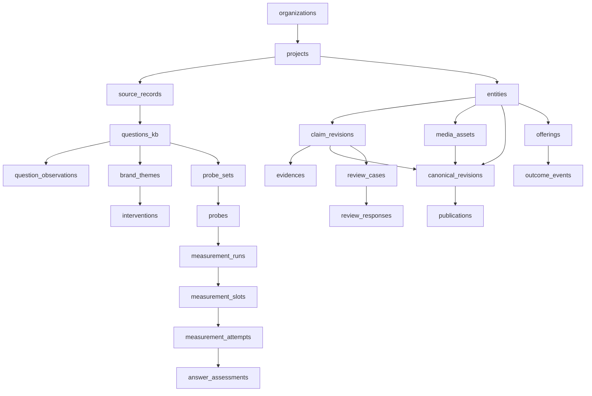

# K-Brand Lab PRD v3.0 구현 계획

> **입력**: [K_Brand_Lab_PRD_v3_KO.md](file:///c:/Users/User/kplacelab/K_Brand_Lab_PRD_v3_KO.md) (868줄, 18개 절, FR-01~20, INV-01~12, NFR-01~12, AC-01~40)
> **기존 자산**: 20개 마이그레이션 · 11개 측정 스크립트 · 60KB 질문 UI · AEO 엔진 · Theme Lab

---

## Ⅰ. PRD v3 정밀 분석 — 핵심 구조

### 1. PRD의 5대 축

```
[질문 수집·과제 발견] → [AI 측정] → [정본·판정] → [KRole 공개·이용] → [재측정·성과]
         §2~5                §8~9        §6~7          §10              §13~14
```

### 2. 원안(v2)에서 변경된 핵심 사항

| 항목 | v2 기획안 | v3 PRD | 구현 영향 |
|---|---|---|---|
| 6개 측정 엔진을 "실증 완료" 자산 | → **검수 대상 후보**로 전환 | 어댑터별 검수 통과 후에만 production 사용 |
| 응답률·SoV 혼용 | → **M-01~M-16 정밀 지표 정의** | 분모·집계 단위·분류 코드 정확히 구현 필요 |
| L1/L2/L3 고정 계층 | → **관찰 사실 vs 인과 해석** 구분 | 자동 분류와 사람 검수의 경계를 코드로 구현 |
| "비용 0원 교정" 표현 | → **사람·자료·운영 비용 반영** | 비용 추적 모듈 필수 |
| 3회 반복 = 안정성 검증 | → **초기 변동성 관찰** | 3/3을 "안정적 100%"로 표시하지 않는 UI 제약 |
| 브랜드 의도와 다른 AI 표현 = 오류 | → **사실 오류 vs 소비자 관점 분리** | AnswerAssessment에 error_type 필드 필요 |
| KRole 연계 없음 | → **§10 계약 8종 + 이벤트 규칙** | 이벤트 발행·멱등성·순서 보장 구현 필수 |

### 3. PRD v3 신규 불변식 (기존 AGENTS.md INV-1~12와 별도)

PRD v3의 INV-01~12는 **제품 불변식**이며, AGENTS.md의 INV-1~12(코드 불변식)와 병행 적용됩니다:

| PRD INV | 핵심 요구 | 구현 체크포인트 |
|---|---|---|
| INV-01 | 질문 출처 보존 (실제/연구자/AI 구분) | `question.source_type` enum 필수 |
| INV-02 | 원문·분류·해석·과제 제안 별도 저장 | 4-레이어 저장 구조 |
| INV-03 | AI 출력 존재 ≠ 사실성 보증 | UI에서 "AI가 말했으므로 사실" 문구 금지 |
| INV-05 | AI 언급·추천으로 판정 등급 올리지 않음 | `review_case.verdict`가 측정 결과에 종속 불가 |
| INV-06 | 작성자 ≠ 독립 검토자 | `review_response.reviewer_id ≠ claim.author_id` CHECK |
| INV-08 | 분모·누락 공개 | 모든 비율 지표에 분자·분모 동반 표시 |
| INV-09 | 재시도를 독립 표본으로 합산 금지 | Slot vs Attempt 분리 |
| INV-11 | 전후 변화에 "인과 효과" 명칭 금지 | 보고서 템플릿에서 "효과" 대신 "변화" 사용 |
| INV-12 | 같은 자료+버전 = 같은 지표 | 결정적 재계산 테스트 (NFR-03) |

---

## Ⅱ. 기존 자산 재사용성 평가

### 1. 즉시 재사용 (재사용률 70%+)

| 자산 | PRD v3 매핑 | 필요 수정 |
|---|---|---|
| **`measure-person-gemini.ts`** | Gemini+SG 어댑터 (FR-11) | 범용 ProbeSet 로더로 리팩터링 |
| **`measure-person.ts`** | OpenAI 어댑터 (FR-11) | `--provider` 분기를 어댑터 인터페이스로 추상화 |
| **`measure-3tier.ts`** | Slot/Attempt 실행 구조 (§8.4) | 슬롯별 비용·재시도 추적 추가 |
| **`lib/aeo/measure-engine.ts`** | 배치 실행·Rate Limit 방어 | 공급자별 비용표 참조 추가 |
| **Theme Lab 질문 수집** | §5 FR-02~04 질문 등록·분류 | 여정 6단계 + 과제 5종으로 분류 체계 교체 |
| **60KB 질문 UI** | §5.1 질문 지도 화면 | 브랜드 여정 탭으로 레이아웃 변경 |
| **Supabase RLS 패턴** | §11 권한·데이터 보호 | 멀티테넌트 project_id 기반으로 확장 |

### 2. 부분 재사용 (40~70%)

| 자산 | 재사용 부분 | 신규 구현 |
|---|---|---|
| `aeo_measurements` / `aeo_observations` 스키마 | 측정 헤더·관측 구조 80% 일치 | Slot/Attempt 분리, 비용 필드 |
| `policy_themes` 테이블 | 테마 구조 참고 | 브랜드 과제 5종 체계로 전환 |
| `submissions` / `submission_contexts` | 원문·맥락 구조 참고 | SourceRecord 정규화 |
| `vip-renderer.ts` 보고서 생성 | 마크다운 렌더링 구조 | 납품물 D-01~D-08 템플릿 |
| `scorer.ts` / `verification-scorer.ts` | 채점 패턴 | M-01~M-16 정밀 지표로 교체 |

### 3. 완전 신규 구현

| PRD v3 객체 | 기존 대응 | 신규 필요 |
|---|---|---|
| Organization / Project | ❌ | 멀티테넌트 격리의 기반 |
| Entity (브랜드/제품/POI) | `units`는 행정구역 전용 | 부모-자식, 언어별 별칭 |
| ClaimRevision | ❌ | 주장 문장·유형·지식 상태 |
| Evidence / MediaAsset | ❌ | 출처·권리·해시·만료 |
| CanonicalRevision | ❌ | 정본 묶음 (Entity+Claim+Media) |
| ReviewCase / ReviewResponse | ❌ | 독립 2인 검토·이해관계 신고 |
| ProbeSet / Probe | 부분 유사 | branded/open/H2H 유형·번역 쌍 |
| Publication | ❌ | KRole 공개·철회 상태 |
| Intervention | ❌ | 전후 비교 기준점 |
| Offering / OutcomeEvent | ❌ | 상품·거래·이행 추적 |

---

## Ⅲ. 단계별 구현 로드맵

PRD v3 §15.2의 5단계(0~4)를 그대로 따릅니다.

### 단계 0: 기존 자산과 고객 점검 (1주)

> **목표**: 재사용 범위, 자료 접근, 책임자와 비용 상한 확정

| # | 작업 | 산출물 |
|---|---|---|
| 0-1 | 기존 측정 스크립트 11종 검수 (§17.1) | 어댑터별 통과/실패/수정 필요 판정표 |
| 0-2 | 기존 DB 스키마 20개 마이그레이션 정리 | PRD v3 객체 ↔ 기존 테이블 매핑표 |
| 0-3 | 원자료 재집계 (§17.1 합계 정합성) | 실제 질문/슬롯/시도/성공/출처 단위별 정확한 카운트 |
| 0-4 | 첫 고객·제품군·시장·언어 후보 선정 | 고객 프로파일 + 자료 권한 + 비용 상한 문서 |
| 0-5 | `.env.local` 키 확인 + 공급자 약관 점검 | 어댑터 활성화 가능 범위 확정 |

---

### 단계 1: 내부 도구 구현 (2~3주)

> **목표**: 고정 검수 자료 통과, 슬롯·재시도·비용 집계 정상

#### 1A. 데이터베이스 스키마 확장

**마이그레이션 `20260910000021_kbrandlab_core.sql`** — 핵심 테이블 15종

```sql
-- 멀티테넌트 기반
organizations, projects

-- 질문·과제 계층
source_records, questions_kb, question_observations, brand_themes

-- 정본·검증 계층
entities, claim_revisions, evidences, media_assets, canonical_revisions

-- 측정 계층 (기존 aeo_* 확장)
probe_sets, probes, measurement_runs, measurement_slots, measurement_attempts,
answer_assessments

-- 배포·비즈니스 계층
publications, interventions, offerings, outcome_events

-- 판정 계층
review_cases, review_responses
```

> [!IMPORTANT]
> `measurement_slots`와 `measurement_attempts`의 분리가 PRD v3의 핵심입니다(§8.4).
> - **Slot**: 질문 1개 × 언어 1개 × 환경 1개 × 반복 1회 = 논리적 관찰 단위
> - **Attempt**: 해당 슬롯에서 실제로 전송한 요청 (재시도 포함)
> - 집계는 Slot 기준, 비용은 Attempt 기준 (AC-16)

#### 1B. 공급자 어댑터 정규화

기존 스크립트에서 추출하여 `lib/kbrandlab/adapters/` 구조로 통합:

```
lib/kbrandlab/
├── adapters/
│   ├── types.ts          # 공통 인터페이스: AdapterConfig, RawResponse, SourceChunk
│   ├── openai.ts         # measure-person.ts에서 추출 (FR-11)
│   ├── gemini-sg.ts      # measure-person-gemini.ts에서 추출 (FR-11)
│   └── adapter-registry.ts  # 검수 상태 관리 (§8.2)
├── measurement/
│   ├── run-engine.ts     # 배치 실행 + 비용 추적 (FR-10, NFR-05)
│   ├── slot-manager.ts   # Slot/Attempt 분리 (§8.4)
│   └── cost-tracker.ts   # 비용 한도 감시 (AC-28)
├── analysis/
│   ├── metrics.ts        # M-01 ~ M-16 산출 (§8.6)
│   ├── source-analyzer.ts   # 출처 정규화·관리 가능 분류 (§8.7)
│   └── assessment.ts     # 응답 분류 (§8.5) + 주장 대조
├── questions/
│   ├── journey-classifier.ts   # 6단계 여정 분류 (§5.3)
│   ├── issue-classifier.ts     # 5종 과제 분류 (§5.3)
│   └── probe-builder.ts       # ProbeSet 생성·버전 관리 (FR-09)
└── reports/
    ├── templates.ts      # D-01 ~ D-08 납품물 템플릿 (§14.1)
    └── snapshot.ts       # 재현 가능 보고서 스냅샷 (INV-12, NFR-03)
```

#### 1C. 핵심 지표 구현 (M-01 ~ M-16)

PRD v3 §8.6의 16개 지표를 구현합니다. 각 지표는 **분자·분모를 반드시 동반**합니다 (INV-08):

| 지표 | 구현 우선도 | 핵심 로직 |
|---|---|---|
| **M-01** 수집 완료율 | P0 | `N_cap / N_plan` |
| **M-02** 기술 성공률 | P0 | `N_cap / N_started` (슬롯 기준, 시도 아님) |
| **M-03** 실질 답변률 | P0 | `substantive / N_cap` |
| **M-04** 브랜드 언급률 | P0 | 엔티티 식별 응답 / N_answer |
| **M-06** 추천 응답률 | P0 | open 질문 중 추천 / N_answer |
| **M-07** 추천 점유율 | P0 | 대상 추천 / 경쟁군 추천 합 |
| **M-08** H2H 결과 분포 | P0 | 5분류 (우세/열세/조건부/동률/판단불가) |
| **M-09** 공식 채널 인용률 | P0 | 공식 URL 인용 / 인용 지원 N_answer |
| **M-10** 출처별 인용 비중 | P0 | 도메인별 고유 (응답 × URL) |
| **M-11** 직접 갱신 가능 출처 비중 | P0 | 관리 URL / 전체 URL |
| **M-13** 확인된 주장 정확도 | P0 | 맞음 / (맞음 + 틀림), 미확인 별도 |
| **M-16** 언어별 관찰 차이 | P0 | 동일 쌍 기준 %p 차이 |

#### 1D. 검수 자료 (§16.4 계산 검수)

PRD v3가 직접 제공한 fixture (§16.4)를 자동화 테스트로 구현:

```typescript
// tests/kbrandlab/metrics.test.ts
// 10슬롯, 12시도, 8캡처, 5답변, 3언급, 2추천 → 경쟁군 {X:2, Y:3, Z:1}
expect(M01(fixture)).toBe(0.80);  // 8/10
expect(M02(fixture)).toBe(0.80);  // 8/10 (슬롯 기준, NOT 8/12)
expect(M03(fixture)).toBe(0.625); // 5/8
expect(M04(fixture)).toBe(0.50);  // 3/6
expect(M06(fixture)).toBe(0.333); // 2/6
expect(M07(fixture, 'X')).toBe(0.333); // 2/(2+3+1)
```

---

### 단계 2: 판정과 공개 연결 (2~3주)

> **목표**: §16 P0 검수 통과 및 한 흐름의 실제 완주

#### 2A. 정본·판정 UI

| 화면 | PRD §5.1 | 구현 방식 |
|---|---|---|
| **정본 편집** | 이미지·언어별 설명·주장·유효 조건 | `app/(org)/kbrandlab/canonical/[entityId]/` |
| **검토 작업함** | 배정 주장, 독립 응답 | `app/(reviewer)/review/` — 다른 검토자 응답 선공개 차단 (AC-09) |
| **측정 설정** | 질문 수, 환경, 반복, 예상 비용 | `app/(org)/kbrandlab/measurement/` |
| **KRole 공개 페이지** | 근거 확인 → 이용 연결 | `app/(public)/krole/[entityId]/` |

#### 2B. KRole 연계 이벤트 (§10)

| 이벤트 | 멱등성 | 순서 보장 |
|---|---|---|
| 정본 변경 알림 | `idempotency_key` 중복 차단 (AC-31) | revision 비교로 오래된 사건 무시 (AC-32) |
| 판정 변경 알림 | 동일 | 동일 |
| 공개 요청/철회 | 동일 | 게시·캐시 상태 5분 갱신 (NFR-08) |
| 이용 사건 수집 | 결제 ID 중복 제거 (AC-33) | 동일 |

#### 2C. AC-01~40 검수 매핑

PRD §16의 40개 수용 기준을 단계별로 매핑:

| 단계 | 검수 항목 |
|---|---|
| **1 (내부 도구)** | AC-02, AC-03, AC-04, AC-11, AC-16~AC-30 (측정·지표) |
| **2 (판정·공개)** | AC-01, AC-05~AC-10, AC-12~AC-15, AC-31~AC-40 (격리·판정·연계) |
| **3 (유료 실증)** | 전체 AC-01~40 재검수 + 실제 고객 데이터로 확인 |

---

### 단계 3: 유료 현장 실증

> PRD §15.1 초기 실증 범위: 제품군 1개, 엔티티 5~10개, 질문 100~200건, 20문항 측정

### 단계 4: 반복 판매 검토

> 유료 프로젝트 3곳 + 최소 1건 실제 유료 갱신 확인 (§15.4)

---

## Ⅳ. 마이그레이션 설계 (단계 1A 상세)

> [!IMPORTANT]
> 기존 20개 마이그레이션은 **수정하지 않습니다** (AGENTS.md 규칙). 새 마이그레이션으로 추가합니다.

### 테이블 생성 순서 (외래키 의존성 기준)



### 핵심 enum 타입

```sql
-- 질문 출처 (INV-01)
CREATE TYPE question_source AS ENUM ('consumer_actual', 'researcher_derived', 'ai_suggested');

-- 응답 의미 분류 (§8.5)
CREATE TYPE response_semantic AS ENUM ('substantive', 'insufficient', 'refusal', 'empty', 'off_topic', 'unclassified');

-- 수집 상태 (§8.5)
CREATE TYPE capture_status AS ENUM ('captured', 'technical_failed', 'cancelled', 'unattempted');

-- 주장 지식 상태 (§6.3)
CREATE TYPE claim_knowledge_state AS ENUM ('brand_reported', 'supported', 'contradicted', 'insufficient', 'disputed', 'expired');

-- 프로브 유형 (§8.3)
CREATE TYPE probe_type AS ENUM ('branded', 'open', 'h2h', 'fact_check');

-- 출처 관리 가능성 (§8.7)
CREATE TYPE source_control AS ENUM ('direct', 'contractual', 'third_party_request', 'no_control', 'unknown');

-- H2H 결과 (§8.6 M-08)
CREATE TYPE h2h_result AS ENUM ('target_favorable', 'opponent_favorable', 'conditional', 'tie', 'indeterminate');
```

---

## Ⅴ. 검증 계획

### 자동화 테스트

```bash
# 1. 기존 불변식 테스트 (AGENTS.md)
pnpm test:invariants

# 2. 지표 계산 결정적 재현 테스트 (NFR-03, §16.4)
pnpm test:kbrandlab:metrics

# 3. 멀티테넌트 격리 테스트 (NFR-01, AC-01)
pnpm test:kbrandlab:isolation

# 4. Slot/Attempt 비용 추적 테스트 (AC-16, NFR-05)
pnpm test:kbrandlab:cost

# 5. 어댑터 정규화 테스트 (FR-11, AC-18~19)
pnpm test:kbrandlab:adapters
```

### 수동 검증

- 단계 2 완료 시: 한 브랜드에 대해 질문 등록 → 과제 도출 → 측정 실행 → 정본 편집 → 검토 → KRole 게시 → 재측정의 **전체 흐름 완주** 확인
- AC-01: 고객 A 계정으로 고객 B 객체 조회 시 접근 차단 확인
- AC-09: 첫 검토 제출 전 다른 검토 결과 접근 차단 확인

---

## Ⅵ. Open Questions

> [!IMPORTANT]
> **KRole 시스템의 현재 상태**: PRD v3 §10은 KRole을 별도 서비스 또는 동일 저장소로 가정합니다. 현재 kplacelab 저장소에 KRole이 구현되어 있는지, 별도 저장소인지에 따라 §10 계약의 구현 방식(API vs 같은 DB 참조)이 결정됩니다. **현재 코드베이스에는 KRole 구현이 없습니다.**

> [!IMPORTANT]
> **첫 고객**: PRD §2.1에서 "특정 국가나 업종으로 고정하지 않는다"고 명시합니다. 단계 0에서 첫 고객·제품군 확정이 필요합니다.

> [!WARNING]
> **기존 PlaceLab과의 공존**: K-Brand Lab 스키마를 같은 Supabase 인스턴스에 추가하면 기존 PlaceLab(`units`, `tech_scans`, `observations` 등)과 같은 DB에 공존합니다. 네임스페이스 충돌 방지를 위해 K-Brand Lab 테이블에 `kb_` 접두사를 사용하는 것을 제안합니다.

> [!NOTE]
> **PRD v3 §17.1 원자료 재집계**: 이번 세션의 실측 총량(김민석 525회, 제주 510회)의 정확한 카운트를 질문/슬롯/시도/성공/출처 단위로 재집계하라는 요구사항이 있습니다. 이는 단계 0의 작업 0-3에서 수행합니다.

---
*PRD v3.0 (868줄, 2026-09-09) + 기존 코드베이스 분석 기반 · 단계 0~4 로드맵*
