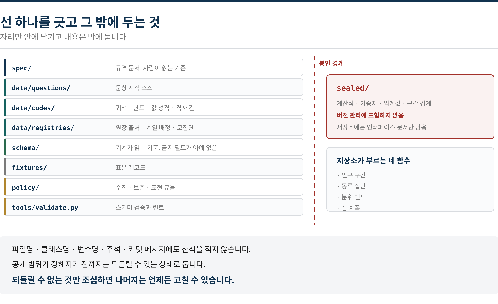
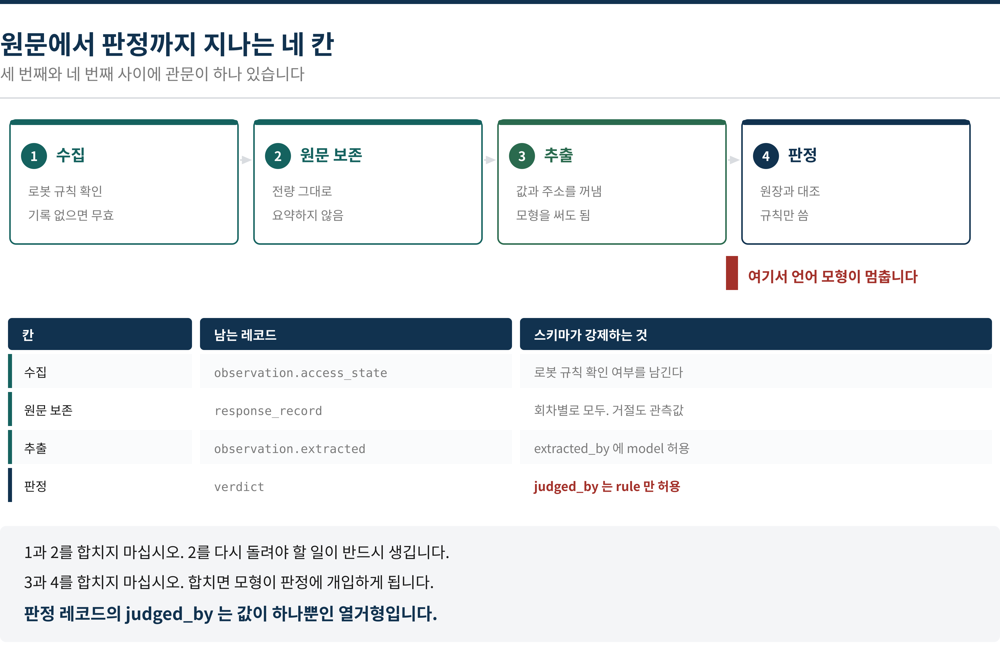
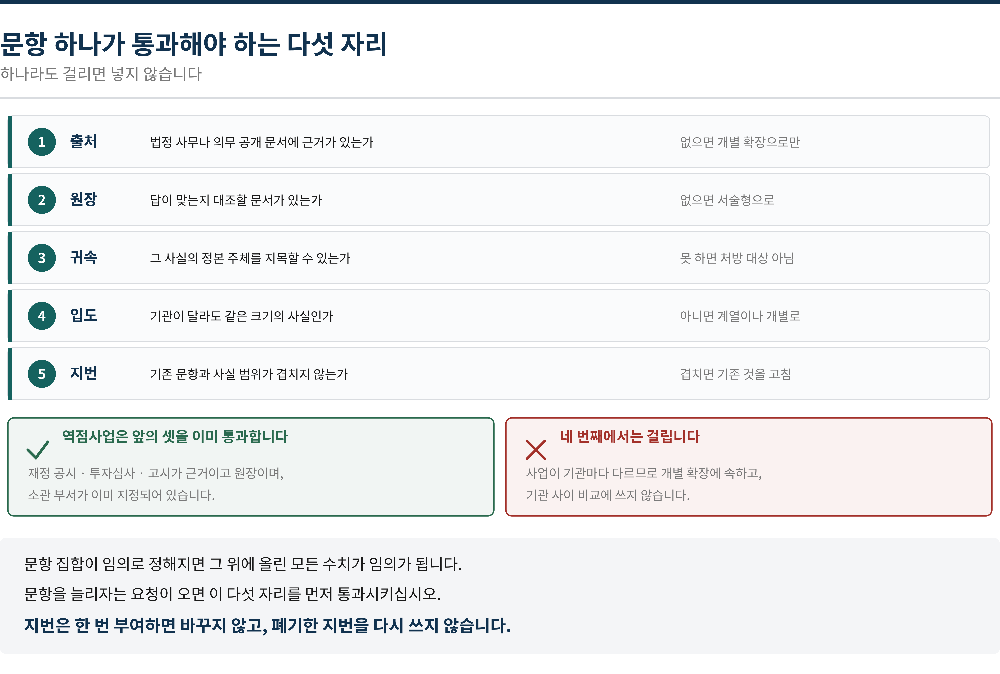
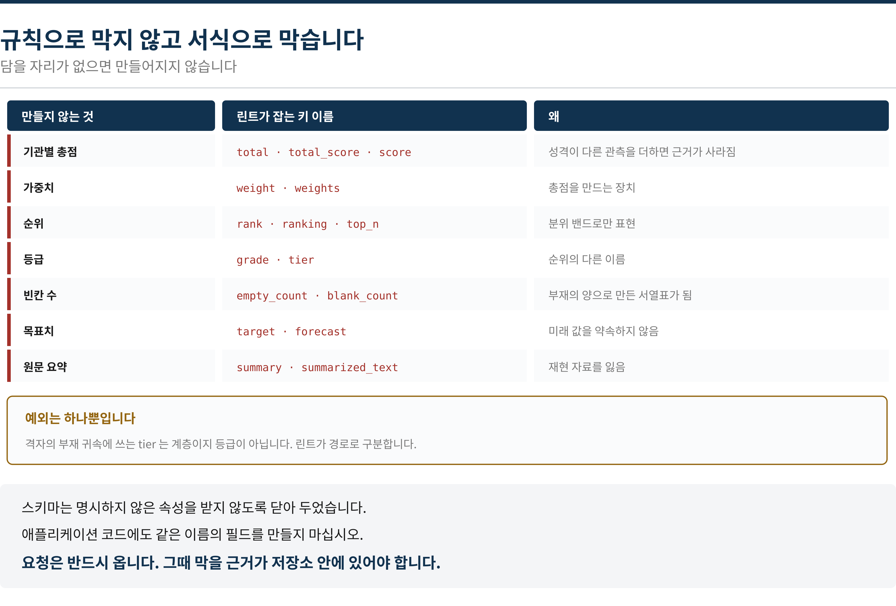
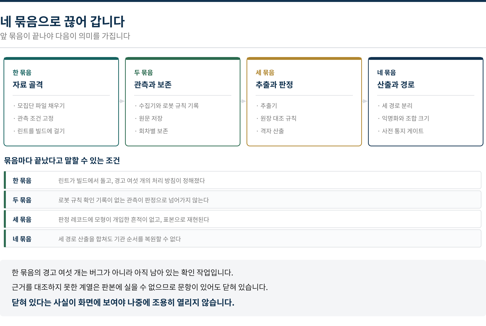

# 무엇을 관측하고 무엇을 만들지 않는가

**지자체 정보 상태 측정 시스템 작업지시서 · 역점사업 관측 포함**

> 개발팀 전달용 · 이 저장소(`measurement-spec`)와 함께 읽습니다.
> 작성 기준일 2026년 9월 14일

| | |
|---|---|
| 무엇 | 측정 시스템 구현팀에 전달하는 작업지시서 |
| 함께 전달 | 이 저장소 — 문항·코드표·스키마·표본·검증 도구 |
| 단일 출처 | **문항과 코드값을 애플리케이션 코드에 다시 적지 않는다** |
| 가장 중요한 제약 | **산식을 저장소에 적지 않는다. 총점·순위·등급을 만들지 않는다** |
| 검증 | `python3 tools/validate.py` — 오류 0 · 경고 6 상태로 전달 |
| 경고 여섯 개 | 버그가 아니라 아직 남아 있는 확인 작업 ([07장](#07-지금-비어-있는-것-여섯-가지)) |

> **이 문서를 읽는 사람에게**
> 구현 기술은 정하지 않습니다. 저장소·언어·배포 방식은 구현팀이 정합니다.
> 이 문서가 정하는 것은 **무엇을 기록으로 남기고 무엇을 남기지 않는가** 하나입니다.
> 그 선을 넘으면 나중에 되돌릴 수 없습니다.

---

## 목차

- [00 저장소 안과 저장소 밖](#00-저장소-안과-저장소-밖)
- [01 자료가 지나는 네 칸](#01-자료가-지나는-네-칸)
- [02 문항이 들어오는 다섯 자리](#02-문항이-들어오는-다섯-자리)
- [03 역점사업 지번](#03-역점사업-지번)
- [04 만들지 않는 것](#04-만들지-않는-것)
- [05 공표 경로는 셋이고 담기는 것이 다릅니다](#05-공표-경로는-셋이고-담기는-것이-다릅니다)
- [06 착수 순서와 끝났다고 말할 조건](#06-착수-순서와-끝났다고-말할-조건)
- [07 지금 비어 있는 것 여섯 가지](#07-지금-비어-있는-것-여섯-가지)
- [부록 A 저장소 파일](#부록-a-저장소-파일)
- [부록 B 구현팀이 정하는 것과 정하지 않는 것](#부록-b-구현팀이-정하는-것과-정하지-않는-것)

---

## 00 저장소 안과 저장소 밖



*되돌릴 수 없는 것만 선 바깥에 둡니다*

저장소는 **무엇을 어떻게 관측하고 어떤 형태로 기록할 것인가**를 정의합니다.
지표의 계산식·가중치·임계값·구간 경계는 여기 들어가지 않습니다. 파일명,
디렉터리명, 클래스명, 함수명, 변수명, 주석, 커밋 메시지, 이슈 제목에도 적지
않습니다.

출원 중인 사항의 공개 범위가 아직 정해지지 않았기 때문입니다. **공개된 자리에
적힌 산식은 되돌릴 수 없습니다.** 변리사 검토가 끝나면 그때 어디까지 옮길지
다시 정합니다. 그때까지는 `sealed/` 아래에 두고 버전 관리에서 제외합니다.

애플리케이션이 부르는 것은 네 함수뿐입니다 — **인구 구간**, **동류 집단**,
**분위 밴드**, **잔여 폭**. 구간의 경계값을 부르는 쪽이 알 필요가 없게
설계되어 있습니다. 자세한 것은 [`sealed/interface.md`](sealed/interface.md).

> **돌려주지 않는 함수를 만들지 마십시오**
> 총점, 순서가 있는 목록, 등급 문자열, 빈칸의 개수, 미래 값의 예측 —
> **이런 것을 돌려주는 함수는 부르는 쪽에서 쓸 자리가 없습니다.**

---

## 01 자료가 지나는 네 칸



*합치고 싶어지는 자리가 두 군데 있습니다*

### 1과 2를 합치지 마십시오

수집하면서 바로 값을 꺼내 저장하고 원문을 버리는 구현을 하지 마십시오.
**추출을 다시 돌려야 할 일이 반드시 생깁니다.** 추출 규칙이 바뀌거나 오류가
발견되면 원문 없이는 되돌릴 방법이 없습니다. 그리고 재현 자료로 납품해야
하므로 **응답 원문은 전량 보존**합니다. 요약해 저장하지 않습니다.

회차별 응답도 전부 남깁니다. 대표값 하나만 남기지 마십시오. 회차 사이에 답이
갈리는 것 자체가 관측값이고, 갈린 문항은 `unstable`로 표시해 확정 판정으로
내보내지 않습니다.

### 3과 4를 합치지 마십시오

언어 모형은 **응답 원문에서 값과 주소를 꺼내는 데까지만** 씁니다. 꺼낸 값이
맞는지 틀렸는지는 규칙과 원장 대조로만 정합니다. 판정 레코드의 `judged_by`는
값이 하나뿐인 열거형이라 다른 값을 넣으면 스키마 검증에서 걸립니다.

이것은 성능 문제가 아니라 **재현 가능성** 문제입니다. 모형이 판정에 개입하면
같은 자료로 같은 결과가 나온다고 말할 수 없게 됩니다.

| 칸 | 남는 레코드 | 스키마가 강제하는 것 |
|---|---|---|
| 수집 | `observation.access_state` | 로봇 규칙 확인 여부를 남긴다 |
| 원문 보존 | `response_record` | 회차별로 모두. 거절도 관측값 |
| 추출 | `observation.extracted` | `extracted_by`에 `model` 허용 |
| 판정 | `verdict` | **`judged_by`는 `rule`만 허용** |

---

## 02 문항이 들어오는 다섯 자리



*문항을 늘리자는 요청이 오면 여기부터 통과시킵니다*

문항 집합이 임의로 정해지면 그 위에 올린 모든 수치가 임의가 됩니다. 그래서
문항을 추가·수정·삭제하는 일은 코드를 고치는 일보다 무겁게 다루어야 합니다.

구현에서 지켜야 할 것은 셋입니다.

1. **지번은 영속**입니다. 한 번 부여하면 바꾸지 않고, 폐기한 지번을 다시 쓰지
   않습니다. 판본 사이 비교가 끊깁니다.
2. **값형에는 반드시 원장이 있어야** 합니다 — 스키마가 조건부 규칙으로
   강제하고 있습니다.
3. **서술형에는 정확 층을 붙이지 않습니다.** 값 판정 대상이 아니기 때문입니다.

| 현재 들어 있는 문항 | 수 | 비고 |
|---|---|---|
| 공통 코어 | 30 | 값형 20 · 서술형 10 |
| 계열 코어 | 25 | 다섯 계열 × 5. 네 계열은 아직 닫혀 있음 |
| 역점사업 지번 | 템플릿 | **사업 하나마다 여섯 물음을 생성** |

> 공통 코어 30문항 가운데 하나는 민감도 `restricted`입니다. 재난 대피 안내에
> 관한 문항이며, 측정하되 공표 경로에서 제외됩니다. 이 동작을 설정으로 켤 수
> 있게 만들지 마십시오.

자세한 규격은 [`spec/02_질문필지_규격.md`](spec/02_질문필지_규격.md).

---

## 03 역점사업 지번

역점사업은 **개별 확장**에 속합니다. 사업이 기관마다 다르므로 입도 관문을
통과하지 못하기 때문입니다. 다만 다른 개별 확장과 달리 출처·원장·귀속 세
관문을 이미 통과한 상태로 들어옵니다 — 재정 공시와 투자심사와 고시가 근거이자
원장이고, 소관 부서가 이미 지정되어 있습니다.

### 레코드를 만들 수 없는 조건

대상 요건 셋을 모두 채우지 못하면 `project_record` 자체를 만들 수 없게 스키마를
닫아 두었습니다. 특히 세 번째 **공식 사업명 확정**을 느슨하게 풀지 마십시오.
가칭에 정본을 만들면 나중에 **두 이름이 모두 남아** 답이 갈라집니다.

```
eligibility.budgeted  예산서 또는 재정 공시에 사업명이 있는가
eligibility.owned     사무 분장 규칙에서 소관을 지목할 수 있는가
eligibility.named     가칭이 아닌가

  셋 모두 const: true 이므로 하나라도 false 면 레코드가 만들어지지 않는다
```

### 단계가 중심입니다

여섯 물음 가운데 **단계**가 이 제품의 중심입니다. 나머지는 한 번 적어두면
오래 가지만 단계는 착공·변경·준공을 거치며 계속 바뀌고, 바뀐 사실을 답변이
따라오지 못합니다. 지배적으로 나타나는 부정합은 `C3` 시점 어긋남입니다.

구현에서 주의할 것이 둘 있습니다.

- `stage_as_of`를 관측과 같은 날짜로 맞추십시오. 다른 날짜의 원장과 대조하면
  어긋남이 아닌 것이 어긋남으로 나옵니다.
- **원장 자체가 낡아 있는 경우**가 있습니다. 재정 공시가 갱신되지 않아 준공된
  사업이 추진 중으로 남아 있는 식입니다. 이때는 `ledger_stale`을 표시하고
  판정하지 않습니다.

> **적지 않음은 결손이 아닙니다**
> 보상 협의 중인 위치, 확정되지 않은 입지, 선정 전인 사업자 — 기관이 아직
> 공개할 수 없는 것이 있습니다. **이것을 빈칸과 같게 처리하면 정당한 판단이
> 결손으로 집계됩니다.** `withheld` 배열에 사유와 함께 기록하고 산출물에서
> 구분해 표기하십시오.

템플릿은 [`data/questions/project_template.json`](data/questions/project_template.json).

---

## 04 만들지 않는 것



*스키마와 린트가 함께 막습니다*

이 목록은 취향이 아니라 제약입니다. 총점은 성격이 다른 관측을 더해 근거를
지우고, 순위와 등급은 기관을 때리는 도구가 되며, 빈칸의 개수는 **부재의 양으로
만든 서열표**가 되어 순위 금지 원칙을 우회합니다.

<!-- lint:allow-banned:start -->

| 만들지 않는 것 | 린트가 잡는 키 이름 | 왜 |
|---|---|---|
| 기관별 총점 | `total` · `total_score` · `score` | 성격이 다른 관측을 더하면 근거가 사라짐 |
| 가중치 | `weight` · `weights` | 총점을 만드는 장치 |
| 순위 | `rank` · `ranking` · `top_n` | 분위 밴드로만 표현 |
| 등급 | `grade` · `tier` | 순위의 다른 이름 |
| 빈칸 수 | `empty_count` · `blank_count` | 부재의 양으로 만든 서열표가 됨 |
| 목표치 | `target` · `forecast` | 미래 값을 약속하지 않음 |
| 원문 요약 | `summary` · `summarized_text` | 재현 자료를 잃음 |

<!-- lint:allow-banned:end -->

그래서 규칙으로 막지 않고 서식으로 막았습니다. 모든 스키마가
`additionalProperties: false`로 닫혀 있어 명시하지 않은 필드를 받지 않고,
`tools/validate.py`가 저장소 전체에서 금지 키 이름을 찾습니다.
**애플리케이션 코드에도 같은 이름의 필드를 만들지 마십시오.**

예외는 하나뿐입니다. 격자의 부재 귀속에 쓰는 `tier`는 직접·산하·협력·통제
불가를 가리키는 **계층**이지 등급이 아닙니다. 린트가 경로로 구분합니다.

<!-- lint:allow-banned:start -->

> 요청은 반드시 옵니다. "종합 점수를 달라", "어디가 제일 잘하나", "빈칸이 가장
> 많은 곳은 어디인가". 그때 막을 근거가 저장소 안에 있어야 개인의 판단으로
> 버티지 않아도 됩니다.

<!-- lint:allow-banned:end -->

---

## 05 공표 경로는 셋이고 담기는 것이 다릅니다

| 경로 | 기관 표기 | 담기는 것 | 담지 않는 것 |
|---|---|---|---|
| **전국 공표문** | 익명 손잡이 | 분포와 밴드 | 개별 기관 지목 · 개별 확장 · 역점사업 |
| **기관별 통보서** | 해당 기관만 실명 | 그 기관의 상태와 고칠 목록 | 다른 기관의 상태 |
| **익명 원자료** | 익명 손잡이 | 재현용 원자료 | 개별 확장 · 역점사업 · 민감 문항 |

세 경로를 합쳐서 **기관 순서를 복원할 수 있어서는 안 됩니다.** 가장 흔한 누출
경로는 익명 원자료입니다. 동류 집단과 계열을 동시에 넣으면 좁은 조합에서
기관이 특정됩니다. `min_cell_size` 미달 조합은 반드시 제외하십시오.

### 막아야 하는 두 게이트

**첫째, 사전 통지와 확인 기간**을 거치지 않은 결과는 공표로 넘어갈 수 없습니다.
스키마가 전국 공표문에 대해 `notified_at`과 `review_closed_at`을 필수로
요구하지만, 파이프라인에서도 막으십시오.

**둘째, 민감도 `restricted`** 문항은 공표 경로에서 무조건 제외됩니다.
재난·안전 영역은 답을 만드는 대상이 아니라 답이 나가지 않게 관리하는
대상입니다. 측정하되 공표하지 않고 해당 기관에만 비공개로 통보합니다.

역점사업 산출은 **기관별 통보서 경로로만** 나갑니다. 그리고 단체장의
성명·사진·업적을 담지 않습니다. 산출물이 홍보물로 읽히면 기관이 위법 소지를
안습니다.

### 산출 순서를 바꾸지 마십시오

산출물의 절 순서는 스키마에 `order`로 고정되어 있고, 화면 배치와 보고서
목차도 이 순서를 따릅니다. **맨 앞에 무엇을 놓느냐가 이 조사의 성격을 정하기
때문**입니다.

| 순서 | 절 | 겹치는가 |
|---|---|---|
| 1 | **정본 부재 영역과 그 귀속** | **겹치지 않음** |
| 2 | 서술형 개체의 실재·등록 상태 | 부분적으로만 |
| 3 | 무응답 귀책 분포 | 겹치지 않음 |
| 4 | 공적 출처가 근거로 쓰인 정도 | **겹침** |
| 5 | 여건 고정 후 잔여 폭 | 겹치지 않음 |

네 번째는 상용 측정 도구가 이미 내놓는 것과 같은 계열입니다. 그것을 첫 절에
올리면 **모형 수와 관측 주기에서 앞서는 도구의 열등한 복제품**으로 읽힙니다.
화면을 만들 때 이 절을 대표 지표처럼 크게 배치하고 싶어질 텐데, 그 유혹이 이
순서를 정해 둔 이유입니다.

> 산출 순서는 자료를 바꾸는 것이 아니라 배치만 바꾸는 일입니다. 그런데 배치가
> 바뀌면 같은 자료가 다른 산출물이 됩니다.

---

## 06 착수 순서와 끝났다고 말할 조건



*한 묶음을 건너뛰면 모은 자료를 버리게 됩니다*

| 묶음 | 내용 |
|---|---|
| 한 묶음 — 자료 골격 | 모집단 파일 채우기 · 관측 조건 고정 · 린트를 빌드에 걸기 |
| 두 묶음 — 관측과 보존 | 수집기와 로봇 규칙 기록 · 원문 저장 · 회차별 보존 |
| 세 묶음 — 추출과 판정 | 추출기 · 원장 대조 규칙 · 격자 산출 |
| 네 묶음 — 산출과 경로 | 세 경로 분리 · 익명화와 조합 크기 · 사전 통지 게이트 |

한 묶음을 건너뛰고 두 묶음부터 시작하고 싶어질 것입니다. 수집기를 먼저 만드는
것이 눈에 보이는 진척이기 때문입니다. 그러나 **모집단 파일과 관측 조건이
고정되지 않은 상태에서 모은 자료는 판본에 쓸 수 없습니다.** 다시 모아야 합니다.

린트를 빌드에 거는 것도 한 묶음에 넣었습니다. 나중에 걸면 이미 들어간 필드를
걷어내야 하고, 그때는 **이미 만든 것을 지우는 일**이 되어 저항이 생깁니다.

| 묶음 | 끝났다고 말할 수 있는 조건 |
|---|---|
| 한 묶음 | 린트가 빌드에서 돌고, 경고 여섯 개의 처리 방침이 정해졌다 |
| 두 묶음 | 로봇 규칙 확인 기록이 없는 관측이 판정으로 넘어가지 않는다 |
| 세 묶음 | 판정 레코드에 모형이 개입한 흔적이 없고, 표본으로 재현된다 |
| 네 묶음 | **세 경로 산출을 합쳐도 기관 순서를 복원할 수 없다** |

---

## 07 지금 비어 있는 것 여섯 가지

검증 도구는 오류 0으로 통과하지만 **경고 여섯 개**를 냅니다. 버그가 아니라
아직 하지 못한 확인 작업이고, 저장소가 그것을 화면에 드러내도록 만들어
두었습니다. **닫혀 있다는 사실이 보여야 나중에 조용히 열리지 않습니다.**

| # | 비어 있는 것 | 누가 | 풀리기 전에는 |
|---|---|---|---|
| 1 | 기관 목록 (모집단 파일) | 우리 | **판본을 열 수 없음** |
| 2 | 관측 조건 (모형·파라미터·기간) | 구현팀과 함께 | **판본을 열 수 없음** |
| 3 | 관광형 계열 근거 자구 대조 | 우리 | 그 계열 문항이 닫힌 채로 |
| 4 | 산업형 계열 근거 자구 대조 | 우리 | 그 계열 문항이 닫힌 채로 |
| 5 | 도농복합형 계열 근거 자구 대조 | 우리 | 그 계열 문항이 닫힌 채로 |
| 6 | 접경·도서형 계열 근거 자구 대조 | 우리 | 그 계열 문항이 닫힌 채로 |

다섯 계열 가운데 근거가 확인된 것은 **인구감소형 하나**뿐입니다. 행정안전부가
법률에 근거해 지정하고 고시하기 때문입니다. 나머지 넷은 지정 근거로 삼으려는
법령의 자구를 아직 대조하지 못했고, 대조하기 전까지는 판본에 실을 수 없습니다.

검증 도구가 이것을 강제합니다. `open_for_publication`이 참인데
`basis_verification`이 확인 상태가 아니면 **경고가 아니라 오류**로 실패합니다.
누군가 급해서 열려고 하면 빌드가 막습니다.

> **1번과 2번이 먼저입니다**
> 기관 목록과 관측 조건 없이는 어떤 관측도 판본에 쓸 수 없습니다.
> **두 파일을 채우는 것이 판본을 여는 첫 작업**이며, 구현 작업보다 앞섭니다.

---

## 부록 A 저장소 파일

```
README.md                    저장소 규율. 먼저 읽는다
작업지시서.md                 이 문서
.gitignore                   sealed/ 제외

spec/00_용어.md               용어. 쓰지 않는 말 포함
spec/01_대상_모집단.md         모집단 · 동류 집단 · 계열 배정
spec/02_질문필지_규격.md       여섯 요건 · 다섯 관문 · 역점사업 특례
spec/03_관측_실행.md           프록시 선언 · 고정 · 추출과 판정의 분리
spec/04_판정_규칙.md           귀책 · 부정합 · 난도 · 격자 판정
spec/05_산출물.md              산출 순서 · 세 경로 · 사전 통지

data/questions/core_common.json           공통 코어 30
data/questions/archetype_*.json           계열 코어 5 × 5
data/questions/project_template.json      역점사업 지번 템플릿
data/codes/*.json                         귀책 · 부정합 · 난도 · 값 성격
                                          격자 칸 · 주체 역할 · 민감도 · 층위
data/registries/ledger_sources.json       원장 출처
data/registries/archetype_assignment.json 계열 배정과 개방 게이트
data/registries/population_frame.json     기관 목록          ← 비어 있음
data/registries/run_profile.json          관측 조건          ← 비어 있음

schema/question.schema.json               문항
schema/response_record.schema.json        응답 원문
schema/observation.schema.json            관측
schema/verdict.schema.json                판정
schema/grid.schema.json                   질문과 주체의 격자
schema/project_record.schema.json         역점사업
schema/output.schema.json                 산출물

fixtures/sample_*.json                    표본 레코드 7종
policy/robots_policy.md                   수집 규율
policy/retention.md                       보존과 공표 시기
policy/banned_terms.json                  금지 표현
policy/forbidden_keys.json                금지 필드
tools/validate.py                         검증과 린트
docs/s23*.png                             이 문서의 도해
sealed/interface.md                       산식 모듈이 제공할 네 함수
```

---

## 부록 B 구현팀이 정하는 것과 정하지 않는 것

| 구현팀이 정합니다 | 우리가 정합니다 |
|---|---|
| 저장소 기술과 자료 구조 | **무엇을 기록으로 남기는가** |
| 언어와 프레임워크 | **무엇을 남기지 않는가** |
| 배포와 운영 방식 | 문항의 내용과 경계 |
| 재시도와 실패 처리의 구체 | **실패를 기록에 남긴다는 원칙** |
| 화면과 조작 방식 | **화면에 띄우면 안 되는 산출** |
| 접근 간격과 동시 연결 수 | **로봇 규칙을 지킨다는 원칙** |
| 성능과 비용 최적화 | **원문을 지우지 않는다는 제약** |

### 막히면 물어볼 자리

구현 중에 **"이렇게 하면 편한데 규격이 막고 있다"**는 상황이 생기면 임의로
풀지 말고 물어보십시오. 대부분은 이유가 있어서 막혀 있고, 이유가 없는 것이면
규격을 고치면 됩니다. **규격을 우회하는 코드를 넣고 나중에 말하는 것**이 가장
나쁩니다 — 그때는 이미 그 형태로 자료가 쌓여 있습니다.

특히 아래 넷은 반드시 물어보고 가십시오. 성능이나 편의를 이유로 풀고 싶어지는
자리들입니다.

| 풀고 싶어지는 자리 | 풀면 생기는 일 |
|---|---|
| 원문을 요약해 저장하기 | 재현 자료를 잃고 납품할 수 없게 됨 |
| 회차별 응답을 대표값 하나로 줄이기 | 불안정한 문항을 확정으로 내보내게 됨 |
| 추출과 판정을 한 번에 처리하기 | 모형이 판정에 개입하게 됨 |
| 빈칸을 세어 정렬 기능 넣기 | 부재의 양으로 만든 서열표가 됨 |

> 저장소를 넘긴 뒤에도 규격은 바뀝니다. 바뀌면 저장소를 고치고 판본 번호를
> 올립니다. 애플리케이션 코드에 옮겨 적은 값이 있으면 그때 어긋나기 시작합니다.
> 단일 출처를 지켜 주십시오.
